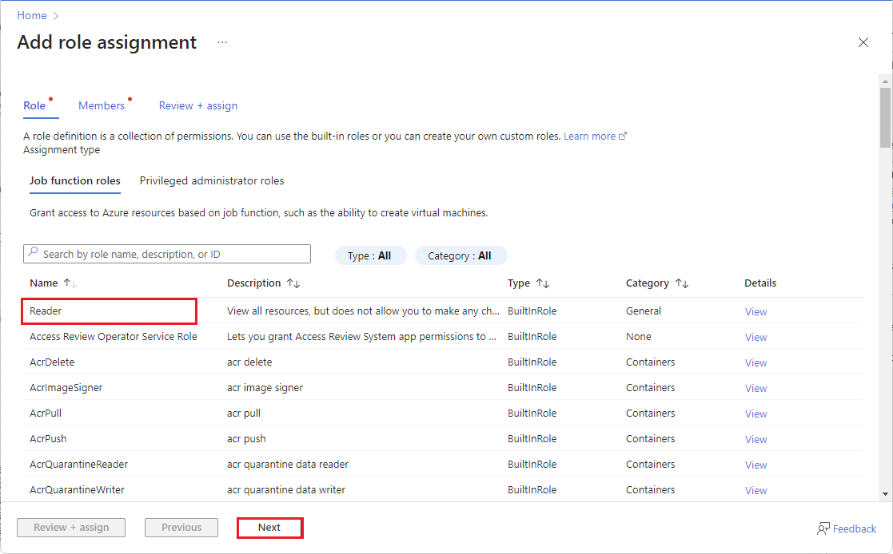
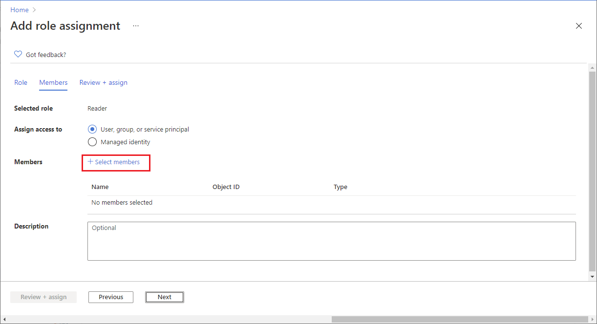

# Assign Reader and Tag Contributor Roles (multiple subscriptions)

You can use Azure Management Groups to grant the Client Portal access to your Azure subscriptions. This approach has the following benefits:&#x20;

* You can assign access to multiple subscriptions in a single step.
* If you create more Azure subscriptions in the future, the access will be automatically granted. It means when you add an Azure subscription to your tenant, there is no need to activate it in the Client Portal.

## How does it work?

When you onboard your tenant to the Client Portal, an Enterprise Application called PyraCloud (Azure) is created in your tenant. You must then assign the [Tag Contributor](https://learn.microsoft.com/en-us/azure/role-based-access-control/built-in-roles#tag-contributor) and [Reader](https://learn.microsoft.com/en-us/azure/role-based-access-control/built-in-roles#reader) roles to the "PyraCloud (Azure)" Enterprise Application:

These roles allow the Client Portal to read a list of all the resources in your Azure subscriptions, and read and write tags on those resources. You can choose whether you want the Client Portal to write tags back to resources in your Azure subscription using the Cloud Tenant Setup feature.

## Granting access using Azure CLI


Before granting access using Azure CLI, note the following points:

* Ensure that you've installed PowerShell and Azure CLI. For installation instructions, see [Install PowerShell](https://docs.microsoft.com/en-us/powershell/scripting/install/installing-powershell) and [Install Azure CLI](https://docs.microsoft.com/en-us/cli/azure/install-azure-cli).
* The script utilizes PowerShell variables, therefore, you must execute this script at a PowerShell prompt instead of a normal command prompt.


Use the following commands to onboard your Azure subscriptions:

<pre class="language-powershell" data-overflow="wrap" data-full-width="false"><code class="lang-powershell">az login

<a data-footnote-ref href="#user-content-fn-1">az rest --method post --url "/providers/Microsoft.Authorization/elevateAccess?api-version=2016-07-01"</a>

az ad sp create --id 2a4807a4-d9e4-457d-b32f-a455e0d3662a

az ad app permission grant --id 2a4807a4-d9e4-457d-b32f-a455e0d3662a --api 00000003-0000-0000-c000-000000000000 --scope "User.Read"

$root_mg=$(az account management-group list --query "[?displayName == 'Tenant Root Group'] | [0] | id" --output tsv)

az role assignment create --assignee "2a4807a4-d9e4-457d-b32f-a455e0d3662a" --role "Reader" --scope "$root_mg"

az role assignment create --assignee "2a4807a4-d9e4-457d-b32f-a455e0d3662a" --role "Tag Contributor" --scope "$root_mg"
</code></pre>

The following table explains these commands:

<table><thead><tr><th width="448">Command</th><th>Description</th></tr></thead><tbody><tr><td><code>az login</code></td><td>Log in to your Microsoft tenant.</td></tr><tr><td><code>az rest --method post --url "/providers/Microsoft.Authorization/elevateAccess?api-version=2016-07-01"</code></td><td>Elevate your permissions to manage all Azure subscriptions and management groups. See <a href="https://docs.microsoft.com/en-us/azure/role-based-access-control/elevate-access-global-admin">Microsoft Documentation</a>.</td></tr><tr><td>
<code>az ad sp create --id 2a4807a4-d9e4-457d-b32f-a455e0d3662a</code>

<code>az ad app permission grant --id 2a4807a4-d9e4-457d-b32f-a455e0d3662a --api 00000003-0000-0000-c000-000000000000 --scope "User.Read"</code>
</td><td>Create the PyraCloud (Azure) service principal (Enterprise Application) in your tenant.</td></tr><tr><td><code>$root_mg=$(az account management-group list --query "[?displayName == 'Tenant Root Group'] | [0] | id" --output tsv)</code></td><td>Get the ID of your Tenant Root Group.</td></tr><tr><td>
<code>az role assignment create --assignee "2a4807a4-d9e4-457d-b32f-a455e0d3662a" --role "Reader" --scope "$root_mg"</code>

<code>az role assignment create --assignee "2a4807a4-d9e4-457d-b32f-a455e0d3662a" --role "Tag Contributor" --scope "$root_mg"</code>
</td><td>Assign the Reader and Tag Contributor roles to the PyraCloud (Azure) application in your Tenant Root Group.</td></tr></tbody></table>

## Granting access using the Azure Portal


Before granting access through the Azure Portal, note the following points:

* Ensure that you've [onboarded your tenant](activate-an-azure-ea-or-mpsa-account.md).
* Ensure that have the correct permissions to manage access to all Azure subscriptions and management groups in your tenant. For instructions, see [Elevate access to manage all Azure subscriptions and management groups](https://learn.microsoft.com/en-us/azure/role-based-access-control/elevate-access-global-admin) in the Microsoft documentation.&#x20;


### Step 1: Search for Management Groups

1. Launch the [Azure Portal](https://portal.azure.com/#home) and search for **Management groups**.
2. On the **Management groups** page, select **Tenant Root Group**. Note that regardless of your organization's configuration, you'll always have a Tenant Root Group. It might have been renamed, but it always appears at the top of the hierarchy.

<figure><figcaption>
Tenant Root Group
</figcaption></figure>

### Step 2: Open the Add role assignment page 

1. From the left sidebar, select **Access control (IAM)**.

<figure><figcaption>
Access control (IAM)
</figcaption></figure>

2. Click **Add** > **Add role assignment**.

<figure><figcaption>
Add role assignment
</figcaption></figure>

The Add role assignment page opens.

### Step 3: Assign the Reader role

1. On the **Role** tab, select **Reader** as the role and click **Next**. The Member tab opens.&#x20;

<figure><figcaption>
Reader role
</figcaption></figure>

2. Select **User, group, or service principal** if it's not selected by default, and then click **Select members**. &#x20;

<figure><figcaption>
Select Members
</figcaption></figure>

3. In the **Select members** panel, type **Pyra** and then select **PyraCloud (Azure)** from the search results.&#x20;

<figure><figcaption>
Choose PyraCloud (Azure)
</figcaption></figure>

4. Click **Select** to add PyraCloud (Azure) to the Members list. Once PyraCloud (Azure) is added, click **Review + assign**.&#x20;
5. On the **Review + assign tab**, review the details and click **Review + assign** to confirm the role assignment.&#x20;

### Step 4: Assign the Tag Contributor role

To assign the Tag Contributor role, follow all of the steps in [Step 3: Assign the Reader role](assign-reader-and-tag-contributor-roles-multiple-subscriptions.md#step-3-assign-the-reader-role), but choose **Tag Contributor** as your role instead of Reader.&#x20;

After you've completed the steps, the roles are assigned and displayed on the **Role assignments** tab.

<figure><figcaption>
Role assignment
</figcaption></figure>

[^1]: 
