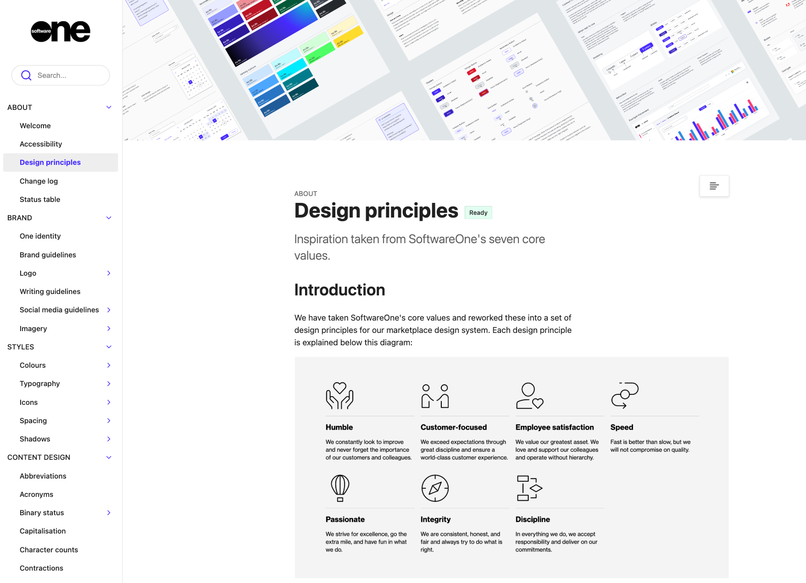

# Design System

The SoftwareOne Design System is a comprehensive set of guidelines, components, and assets that ensures visual and functional consistency across all SoftwareOne digital products.&#x20;

It is the design foundation upon which the SoftwareOne Marketplace Platform is built.&#x20;

Available online at [design.platform.softwareone.com](https://design.platform.softwareone.com/1233aa9e6/p/521ab9-softwareone-design-system), the system includes everything from foundational elements like color palettes, typography, and spacing, to interactive components such as buttons, forms, modals, and navigation patterns. It provides both designers and developers with a shared language and a single source of truth.

<figure><figcaption>
SoftwareOne Design System
</figcaption></figure>

The primary purpose of the design system is to streamline product development, promote UX/UI consistency, and improve scalability. Teams working on the Marketplace Platform should reference the design system to:

* Align designs with established brand and user experience standards.
* Use pre-defined components to ensure consistent implementation across the platform.
* Accelerate the design and development process by reducing redundancy.

The system is continuously maintained and updated to reflect evolving user needs, design best practices, and platform requirements.
