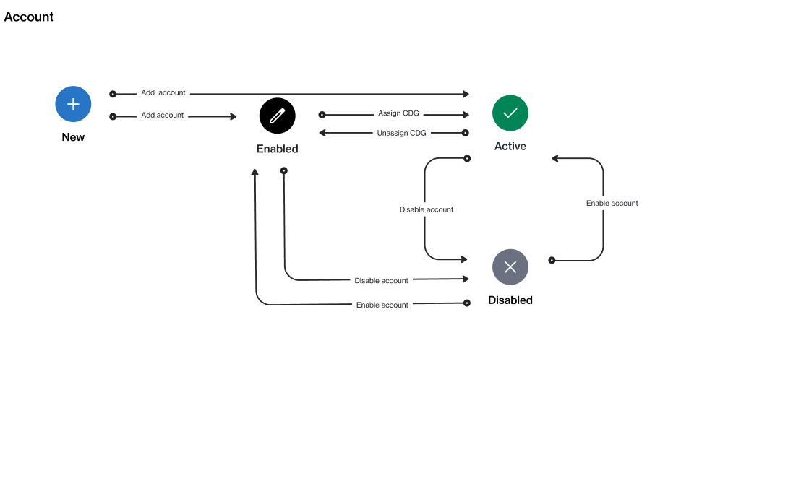
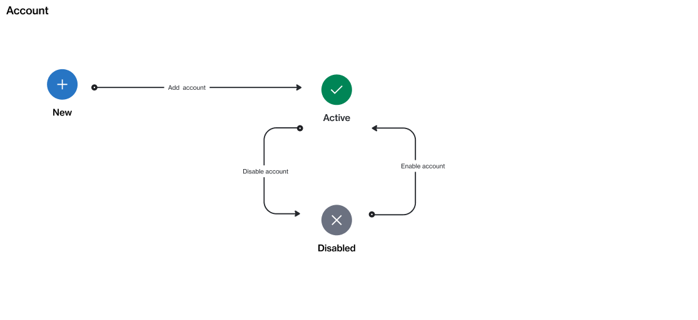

# State Diagram

## Client account

The following diagram shows the status transition process of a client or partner account on the platform.

<figure><figcaption>
The state transition diagram of a client account.
</figcaption></figure>

## Vendor account

The following diagram shows the status transition process of a vendor account on the platform.

<figure><figcaption>
The state transition diagram of a vendor account.
</figcaption></figure>

## State description

<table><thead><tr><th width="124">State</th><th>Definition</th></tr></thead><tbody><tr><td><strong>New</strong></td><td>This is the default state of a newly created account. This state is not visible on the interface.</td></tr><tr><td><strong>Enabled</strong></td><td>The account has been created, but it's not fully set up in our system. While the account can be used for transactions, these transactions will not be completed.</td></tr><tr><td><strong>Active</strong></td><td>The account is fully operational within the Marketplace.</td></tr><tr><td><strong>Disabled</strong></td><td>The account is not available for transactions, and no user can sign in or switch to this account.</td></tr></tbody></table>
