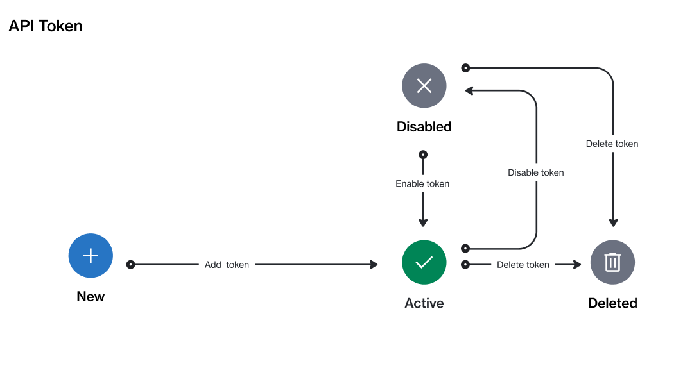

# State Diagram

The following diagram shows the status transition process of an API token on the platform.

<figure><figcaption>
The state transition diagram of an API token.
</figcaption></figure>

### State description

<table><thead><tr><th width="124">State</th><th>Definition</th></tr></thead><tbody><tr><td><strong>Active</strong></td><td>The token has been authenticated in the account. It will allow access to the endpoint.</td></tr><tr><td><strong>Disabled</strong></td><td>The token has been temporarily deactivated. Any attempts to access the endpoint will return an error.</td></tr><tr><td><strong>Deleted</strong></td><td>The token has been permanently removed from the system. This state is not visible to the client or vendor account users.</td></tr></tbody></table>
