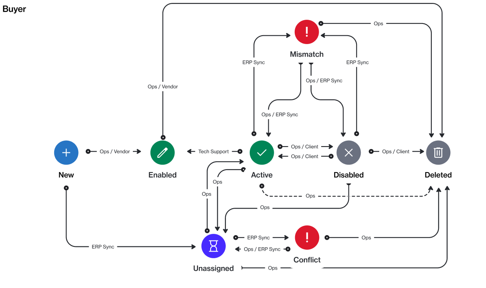

# State Diagram

The following figure shows the state (status) transition process of a Buyer on the platform.

<figure><figcaption>
Buyer state diagram
</figcaption></figure>

### State description 

<table><thead><tr><th width="189">State</th><th>Definition</th></tr></thead><tbody><tr><td><strong>Enabled</strong></td><td>The buyer has been created in the system, but SoftwareOne hasn't activated it yet.</td></tr><tr><td><strong>Active</strong> </td><td>The buyer is active and can be selected from the list of buyers when ordering products.</td></tr><tr><td><strong>Disabled</strong> </td><td>The buyer has been disabled and can no longer be selected when buying products.</td></tr><tr><td><strong>Mismatch</strong> </td><td>The buyer’s data is not in sync with the data in our backend system. This discrepancy can occur due to various reasons. <a href="../../../../help-and-support/contact-support.md">Contact support</a> for assistance.</td></tr></tbody></table>
