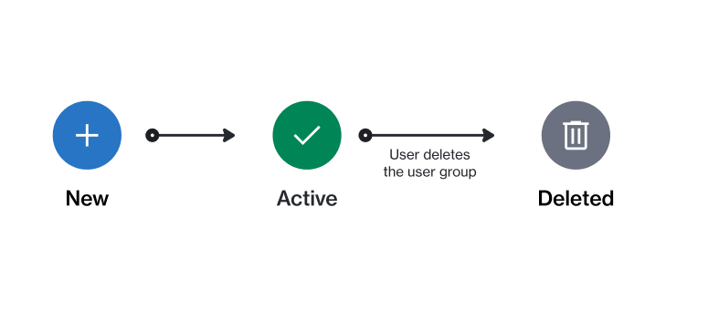

# State Diagram

The following diagram shows the state (status) transition process of a group containing users.

<figure><figcaption>
The state transition diagram of a user group.
</figcaption></figure>

<table><thead><tr><th width="100">State</th><th>Definition</th></tr></thead><tbody><tr><td><strong>New</strong> </td><td>This is the initial status of a group. This status is assigned by the platform when the group is created.</td></tr><tr><td><strong>Active</strong></td><td>The group has been created successfully and is now active.</td></tr><tr><td><strong>Deleted</strong></td><td>The group has been deleted by the account administrator.</td></tr></tbody></table>
