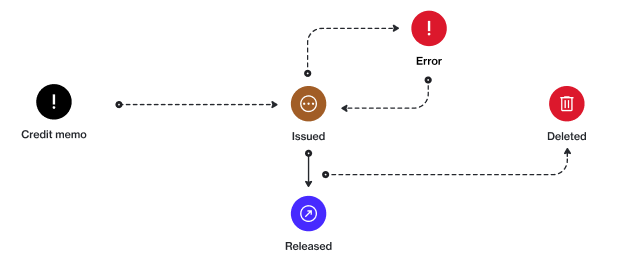

# State Diagram

The following diagram shows the state (or status) transition process of a credit memo.

<figure><figcaption>
Credit memo state transition
</figcaption></figure>

### State description

<table data-full-width="false"><thead><tr><th width="152">State</th><th>Definition</th></tr></thead><tbody><tr><td><strong>Issued</strong></td><td>The credit memo has been issued.</td></tr><tr><td><strong>Error</strong></td><td>An issue has occurred preventing the credit memo from progressing to the next state.</td></tr><tr><td><strong>Released</strong></td><td>The credit memo has been finalized.</td></tr><tr><td><strong>Deleted</strong></td><td>The credit memo has been removed. No further action is possible.</td></tr></tbody></table>
