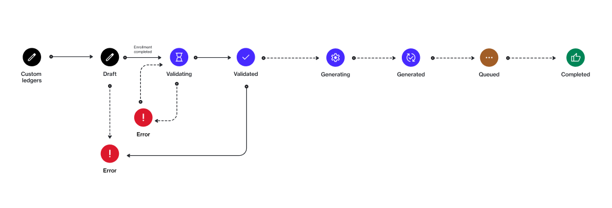

# State Diagram

The following diagram shows the state (or status) transition process of a custom ledger in the Marketplace platform.

<figure><figcaption>
Custom ledger state transition
</figcaption></figure>

### State description

<table data-full-width="false"><thead><tr><th width="152">State</th><th>Definition</th></tr></thead><tbody><tr><td><strong>Draft</strong></td><td>The custom ledger is being prepared.</td></tr><tr><td><strong>Validating</strong></td><td>The ledger data is being validated.</td></tr><tr><td><strong>Validated</strong></td><td>The ledger has passed validation checks successfully.</td></tr><tr><td><strong>Generating</strong></td><td>The system is generating the final version of the ledger.</td></tr><tr><td><strong>Generated</strong></td><td>The ledger has been generated successfully.</td></tr><tr><td><strong>Queued</strong></td><td>The ledger has been queued for processing.</td></tr><tr><td><strong>Completed</strong></td><td>The ledger has been finalized and completed.</td></tr><tr><td><strong>Error</strong></td><td>An issue has occurred preventing the custom ledger from progressing further.</td></tr></tbody></table>
