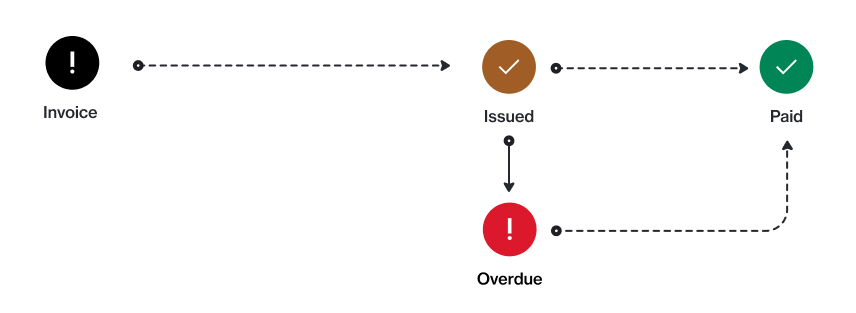

# State Diagram

The following diagram shows how a billing invoice transitions from one state to the next in the Marketplace Platform.

<figure><figcaption>
Invoice state transition
</figcaption></figure>

### State description

<table data-full-width="false"><thead><tr><th width="152">State</th><th>Definition</th></tr></thead><tbody><tr><td><strong>Issued</strong></td><td>The invoice has been issued, but it hasn't been settled yet.</td></tr><tr><td><strong>Paid</strong></td><td>The invoice has been paid in full. No further action is required.</td></tr><tr><td><strong>Overdue</strong></td><td>The invoice is past due.</td></tr></tbody></table>
