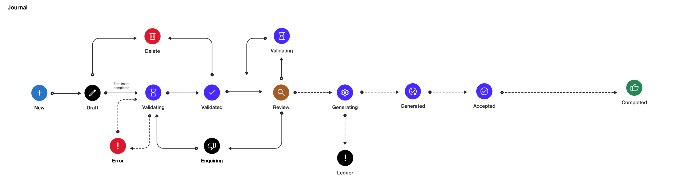

# State Diagram

The following diagram shows the state (status) transition process of a journal on the platform.

<figure><figcaption></figcaption></figure>

### State description

<table data-full-width="false"><thead><tr><th width="152">State</th><th>Definition</th></tr></thead><tbody><tr><td><strong>New</strong></td><td>This is an initial status for a journal.</td></tr><tr><td><strong>Draft</strong></td><td>The vendor has created the journal.</td></tr><tr><td><strong>Validating</strong></td><td>The vendor has submitted the journal data for processing.</td></tr><tr><td><strong>Validated</strong></td><td>The data has been validated.</td></tr><tr><td><strong>Error</strong></td><td>An error occurred due to missing records on the platform.</td></tr><tr><td><strong>Review</strong></td><td>SoftwareOne is reviewing the contents of the journal.</td></tr><tr><td><strong>Enquiring</strong></td><td>The journal has been returned to the vendor for corrections and resubmission.</td></tr><tr><td><strong>Generating</strong></td><td>The journal has been accepted and is being processed by SoftwareOne.</td></tr><tr><td><strong>Ledger</strong></td><td>The platform has created a ledger file in the scope of the given seller.</td></tr><tr><td><strong>Generated</strong></td><td>The statements have been generated.</td></tr><tr><td><strong>Accepted</strong></td><td>The journal has been accepted. </td></tr><tr><td><strong>Completed</strong></td><td>The journal is now complete. This occurs when all ledgers have been marked as completed.</td></tr></tbody></table>
