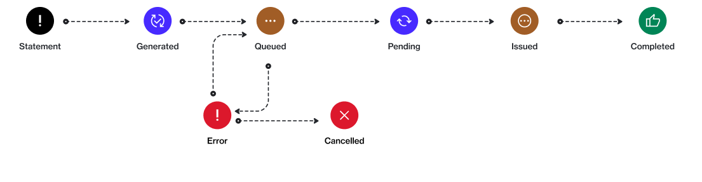

# State Diagram

The following diagram shows the state (status) transition process of a billing statement in the Marketplace Platform:

<figure><figcaption>
The state transition diagram of a statement.
</figcaption></figure>

<table data-full-width="false"><thead><tr><th width="152">State</th><th>Definition</th></tr></thead><tbody><tr><td><strong>Generated</strong></td><td>The statement has been generated.</td></tr><tr><td><strong>Queued</strong></td><td>The statement has been queued and is awaiting the next processing step.</td></tr><tr><td><strong>Pending</strong></td><td>The statement is being processed or reviewed.</td></tr><tr><td><strong>Issued</strong></td><td>The statement has been finalized and sent to the intended recipients.</td></tr><tr><td><strong>Completed</strong></td><td>The statement process is finished successfully. No further actions are required.</td></tr><tr><td><strong>Error</strong></td><td>A processing issue occurred with the statement.</td></tr><tr><td><strong>Cancelled</strong></td><td>The statement process was cancelled and will not proceed further.</td></tr></tbody></table>
