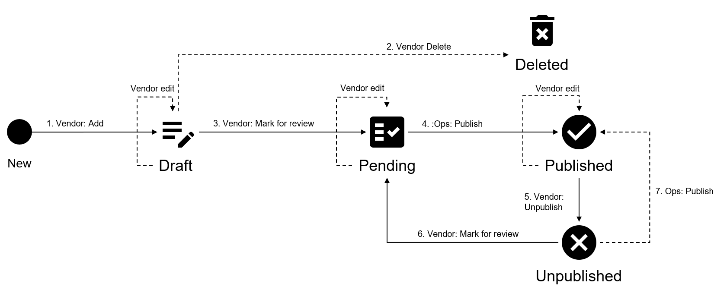

# State Diagram

The following diagram shows the possible states for the documentation object in the Marketplace Platform and the transition between these states:

<figure><figcaption>
The state transition diagram of the documentation object.
</figcaption></figure>

<table><thead><tr><th width="146">State</th><th>Definition</th></tr></thead><tbody><tr><td><strong>Draft</strong></td><td>The documentation object is being created by the vendor. The object is not visible to the clients yet in the marketplace.</td></tr><tr><td><strong>Pending</strong></td><td>The vendor has submitted the documentation object to SoftwareOne Operations for review and publishing.</td></tr><tr><td><strong>Published</strong></td><td>The documentation object is visible in the marketplace.</td></tr><tr><td><strong>Unpublished</strong></td><td>The documentation object is not visible in the marketplace.</td></tr><tr><td><strong>Deleted</strong></td><td>The document object no longer exists. It's no longer part of the product definition and can't be used.</td></tr></tbody></table>
