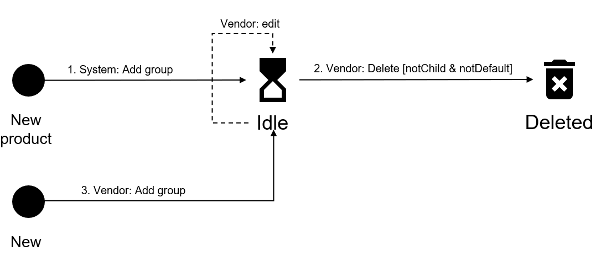

# State Diagram

The following diagram shows the possible states a group object may have in the Marketplace Platform and the transition between these states:

<figure><figcaption>
The state transition diagram of a group.
</figcaption></figure>

<table><thead><tr><th width="123">State</th><th>Definition</th></tr></thead><tbody><tr><td><strong>Idle</strong></td><td>The parameter group has been created as part of the product definition, which will be used as a step in the purchase wizard when a client orders the product.</td></tr><tr><td><strong>Deleted</strong></td><td>The parameter group no longer exists. It's no longer part of the product definition and can't be used anymore.</td></tr></tbody></table>
