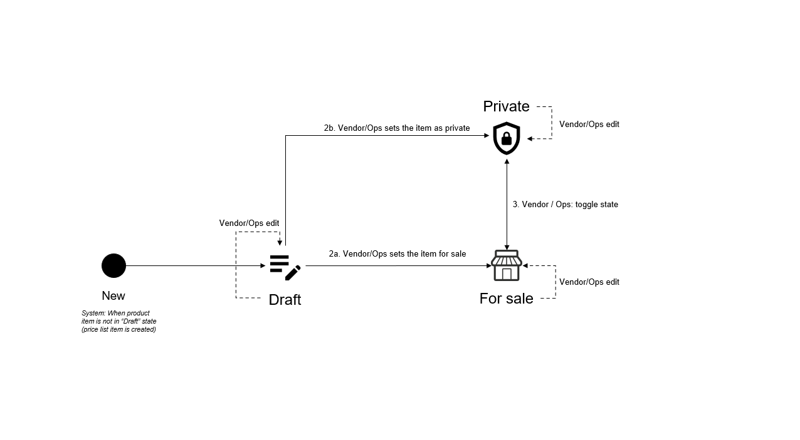

# Pricelist Item States

The following diagram shows the possible states for the pricelist item object in the Marketplace Platform and the transition between these states:

<figure><figcaption>
Pricelist item state transition
</figcaption></figure>

<table><thead><tr><th width="167">State</th><th>Definition</th></tr></thead><tbody><tr><td><strong>Draft</strong></td><td></td></tr><tr><td><strong>Private</strong></td><td></td></tr><tr><td><strong>For sale</strong></td><td></td></tr></tbody></table>
