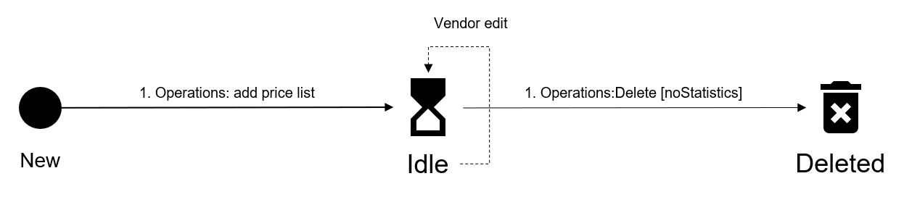

# Pricelist States

The following diagram shows the possible states for the pricelist object in the Marketplace Platform and the transition between these states:

<figure><figcaption>
Pricelist state transition
</figcaption></figure>

<table><thead><tr><th width="128">State</th><th>Definition</th></tr></thead><tbody><tr><td><strong>Idle</strong></td><td>
The pricelist object has been created as part of the product definition. 

It will be used to sell the items against a listing in the scope of authorization.
</td></tr><tr><td><strong>Deleted</strong></td><td>
The price list no longer exists.

It's no longer part of the product definition and can't be used anymore.
</td></tr></tbody></table>
