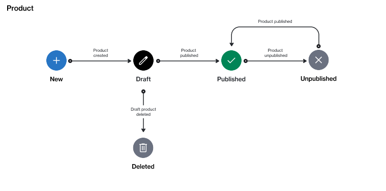

# State Diagram

The following diagram shows the possible states of a product and the transitions between those states in the Marketplace Platform:

<figure><figcaption>
The state transition diagram of a product.
</figcaption></figure>

<table><thead><tr><th width="157">State</th><th>Definition</th></tr></thead><tbody><tr><td><strong>Draft</strong></td><td>The product is being created by the vendor. It is not yet available in the marketplace for ordering.</td></tr><tr><td><strong>Deleted</strong></td><td>The draft product has been deleted.</td></tr><tr><td><strong>Published</strong></td><td>The product is available for buying through the marketplace.</td></tr><tr><td><strong>Unpublished</strong></td><td>The product is no longer available in the marketplace.</td></tr></tbody></table>
