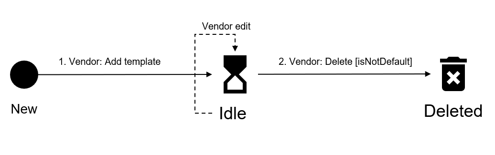

# Templates States

The following diagram shows the possible states for the templates object in the Marketplace Platform and the transition between these states:

<figure><figcaption>
Template state transition
</figcaption></figure>

<table><thead><tr><th width="137">State</th><th>Definition</th><th data-hidden></th></tr></thead><tbody><tr><td><strong>Idle</strong></td><td>
The template object has been created as part of the product definition. 

The object will be used in the scope of orders, agreements, and notification messages.
</td><td></td></tr><tr><td><strong>Deleted</strong></td><td>
The template no longer exists.

It's no longer part of the product definition and can't be used anymore<strong>.</strong>
</td><td></td></tr></tbody></table>
