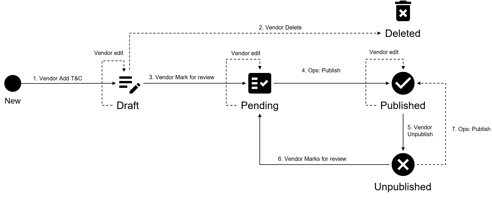

# Terms & Conditions States

The following diagram shows the possible states for the terms and conditions object in the Marketplace Platform and the transition between these states:

<figure><figcaption>
Terms state transition
</figcaption></figure>

<table><thead><tr><th width="154">State</th><th>Definition</th></tr></thead><tbody><tr><td><strong>Draft</strong></td><td>
The terms object is being created by the vendor.

It is not visible to the clients in the marketplace.
</td></tr><tr><td><strong>Pending</strong></td><td>The vendor has submitted the documentation object to SoftwareOne Operations for review and publishing.</td></tr><tr><td><strong>Published</strong></td><td>The terms object is visible in the marketplace.</td></tr><tr><td><strong>Unpublished</strong></td><td>The terms object is not visible in the marketplace.</td></tr><tr><td><strong>Deleted</strong></td><td>
The document object no longer exists.

It is no longer part of the product definition and can't be used.
</td></tr></tbody></table>
