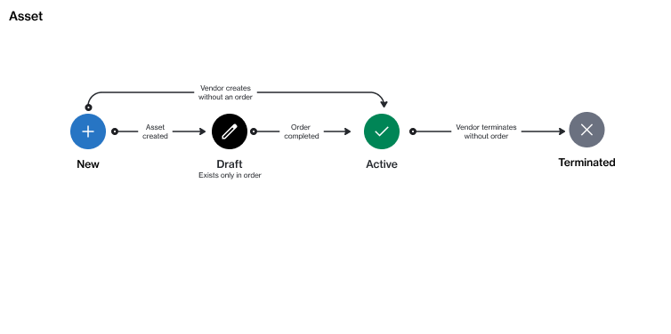

# State diagram

An asset is a one-time purchase item or a perpetual license within the Marketplace Platform.

An asset can currently exist in these states: **New**, **Draft**, **Active**, or **Terminated**. The following diagram shows the transitions between these states:

<figure><figcaption></figcaption></figure>

<table data-full-width="false"><thead><tr><th width="152">State</th><th>Definition</th></tr></thead><tbody><tr><td><strong>New</strong> </td><td>This is the initial status of an asset or one-time item when it's added to the order during the ordering process. The status appears in the purchase wizard only while creating the order.</td></tr><tr><td><strong>Draft</strong></td><td>The status applies to an asset during the fulfillment phase of the order. It means the asset has been created as a result of a purchase order, but it's not active yet.</td></tr><tr><td><strong>Active</strong></td><td>The asset is now active because the associated purchase order has been completed.</td></tr><tr><td><strong>Terminated</strong></td><td>The asset has been cancelled by the vendor. </td></tr></tbody></table>
