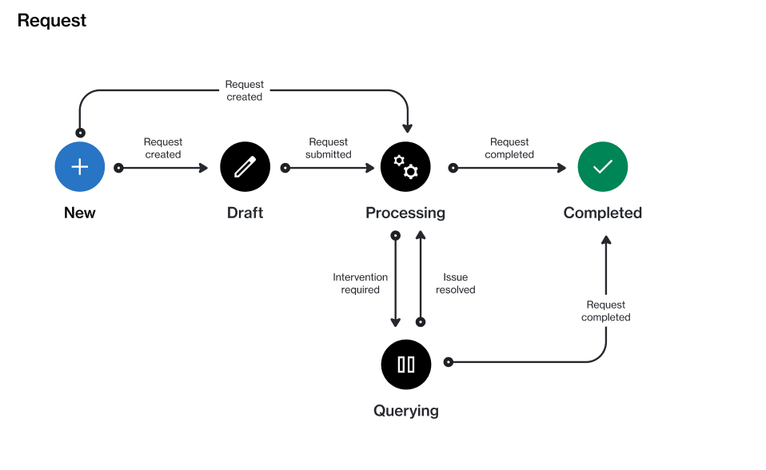

# State Diagram

The following diagram shows the state (status) transition process of a request. A request can currently exist in several states. The following diagram shows the transitions between these states:

<figure><figcaption>
The state transition diagram of a request.
</figcaption></figure>

<table><thead><tr><th width="123">State</th><th>Definition</th></tr></thead><tbody><tr><td><strong>Draft</strong></td><td>The request is being created.</td></tr><tr><td><strong>Processing</strong></td><td>The request is pending a response from the vendor or SoftwareOne.</td></tr><tr><td><strong>Querying</strong></td><td>
The vendor or SoftwareOne has updated the request. 

It now requires an action to be taken by a client account user.
</td></tr><tr><td><strong>Complete</strong></td><td>The request has been completed.</td></tr></tbody></table>
