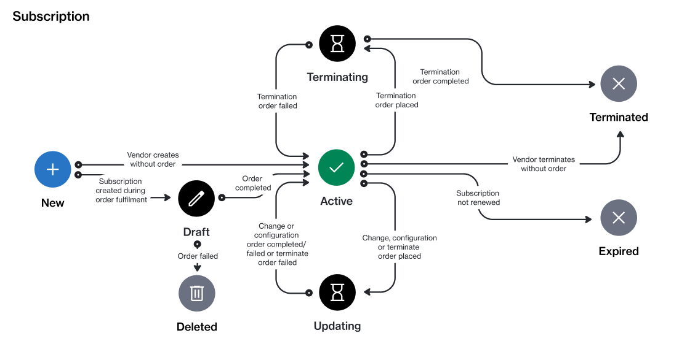

# State Diagram

The following diagram shows the state (status) transition process of a subscription in the Marketplace Platform.

<figure><figcaption>
The state transition diagram of a subscription.
</figcaption></figure>

### State description

<table><thead><tr><th width="135">State</th><th>Definition</th></tr></thead><tbody><tr><td><strong>Draft</strong></td><td>The vendor has created the subscription, but the order has not been completed yet.</td></tr><tr><td><strong>Active</strong></td><td>The subscription is active and in use.</td></tr><tr><td><strong>Updating</strong></td><td>A business transaction is in progress for the subscription. This status applies to change orders submitted for the subscription.</td></tr><tr><td><strong>Terminating</strong></td><td>A termination order has been created for the subscription.</td></tr><tr><td><strong>Terminated</strong></td><td>The vendor has completed the termination order, and the subscription is now terminated.</td></tr><tr><td><strong>Deleted</strong></td><td>The draft subscription has been deleted by the vendor.</td></tr></tbody></table>
