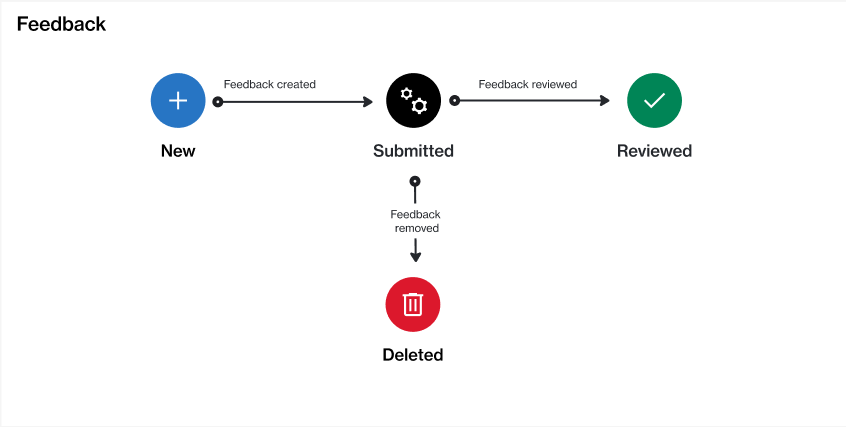

# State Diagram

<figure><figcaption>
The state transition diagram of a feedback object.
</figcaption></figure>

<table><thead><tr><th width="123">State</th><th>Definition</th></tr></thead><tbody><tr><td><strong>New</strong> </td><td>This is the initial status of the feedback.</td></tr><tr><td><strong>Submitted</strong></td><td>The feedback is submitted. This state means that the feedback hasn't been reviewed yet.</td></tr><tr><td><strong>Deleted</strong></td><td>The feedback is rejected, duplicate, irrelevant, or not feasible to act on.</td></tr><tr><td><strong>Reviewed</strong></td><td>The feedback has been reviewed. It is actionable and may be added to the backlog for implementation.</td></tr></tbody></table>
