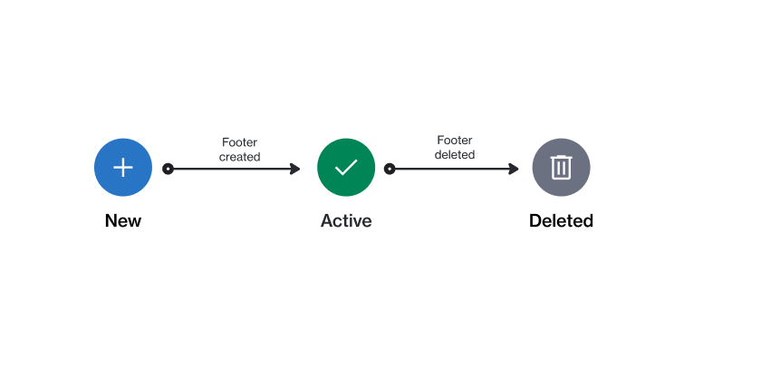

# State Diagram

<figure><figcaption>
The state transition diagram of a category.
</figcaption></figure>

<table><thead><tr><th width="224">State</th><th>Description</th></tr></thead><tbody><tr><td><strong>Active</strong></td><td>The footer is available for use.</td></tr><tr><td><strong>Deleted</strong></td><td>The footer is deleted.</td></tr></tbody></table>
