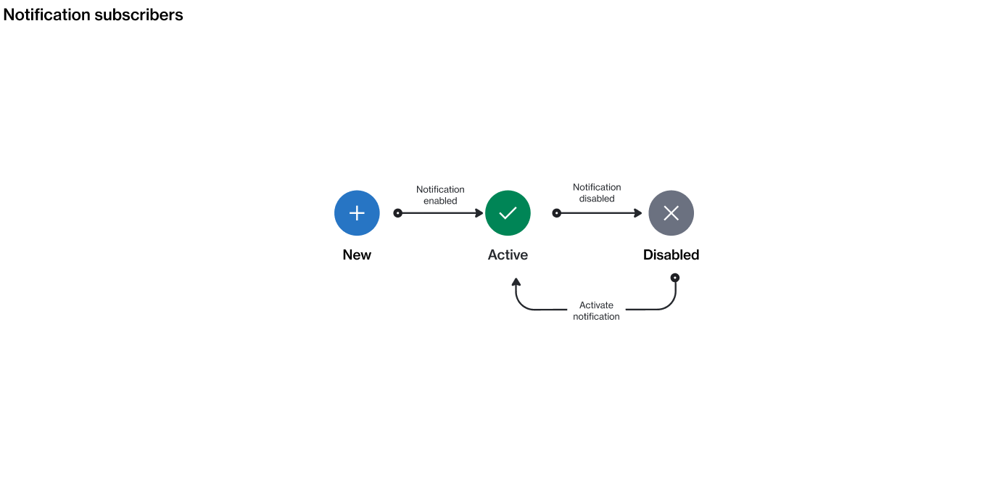

# State Diagram

The following diagram shows the state (status) transition process of a notification subscriber on the platform.

<figure><figcaption>
Subscribe state diagram
</figcaption></figure>

### State description

<table><thead><tr><th width="118">State</th><th>Definition</th></tr></thead><tbody><tr><td><strong>Active</strong></td><td>Indicates that the subscriber is active for receiving messages in the scope of the account. </td></tr><tr><td><strong>Disabled</strong></td><td>Indicates the subscriber has been disabled. </td></tr></tbody></table>
