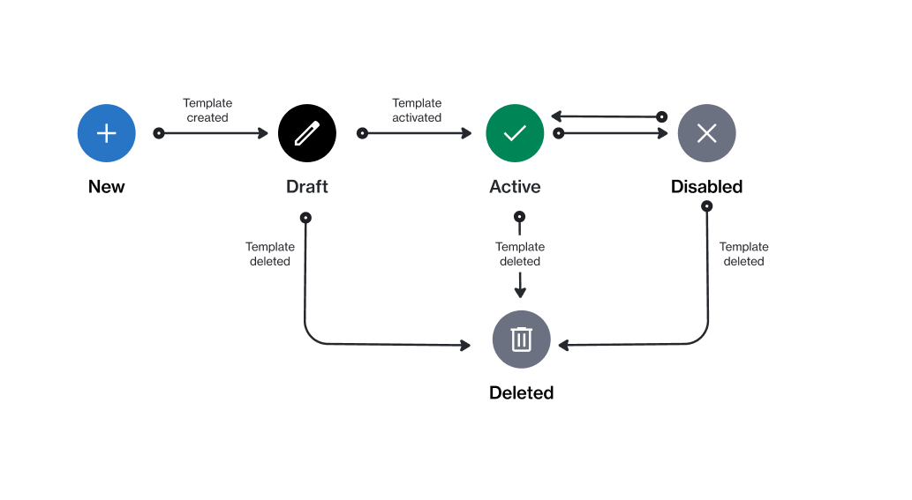

# State Diagram

<figure><figcaption>
The state transition diagram of a message template.
</figcaption></figure>

<table><thead><tr><th width="177">State</th><th>Description</th></tr></thead><tbody><tr><td><strong>Draft</strong></td><td>The template is currently in draft and not ready for use.</td></tr><tr><td><strong>Active</strong></td><td>The template is active and can be used.</td></tr><tr><td><strong>Disabled</strong></td><td>The template has been disabled temporarily. It can be reactivated when needed.</td></tr><tr><td><strong>Deleted</strong></td><td>The template has been deleted.</td></tr></tbody></table>
