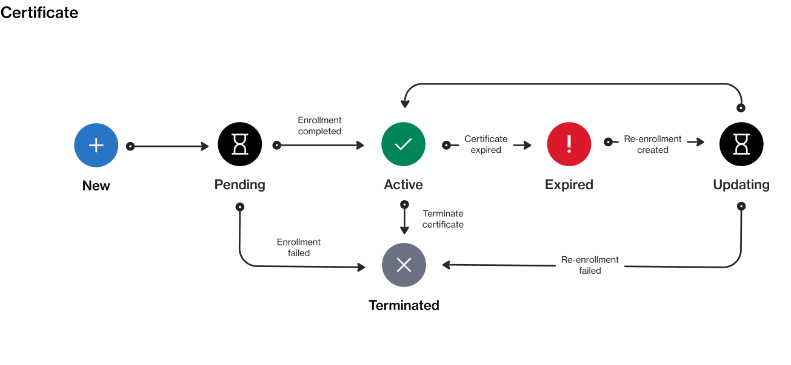

# State Diagram

The following diagram shows the state (status) transition process of a certificate on the platform.

<figure><figcaption>
The state transition diagram of a certificate.
</figcaption></figure>

### State description

<table data-full-width="false"><thead><tr><th width="152">State</th><th>Definition</th></tr></thead><tbody><tr><td><strong>New</strong></td><td>This is the initial status, and it's assigned by the platform when the certificate request is created.</td></tr><tr><td><strong>Pending</strong></td><td>The certificate has been created, and it's awaiting approval by the vendor.</td></tr><tr><td><strong>Active</strong></td><td>The certificate is active.</td></tr><tr><td><strong>Expired</strong></td><td>The certificate has expired. You can renew an expired certificate by re-enrolling in the program.</td></tr><tr><td><strong>Updating</strong></td><td>The certificate is being updated due to re-enrollment in the program.</td></tr><tr><td><strong>Terminated</strong></td><td>The certificate has been terminated. Terminated certificates can't be used to re-enroll in a program. </td></tr></tbody></table>
