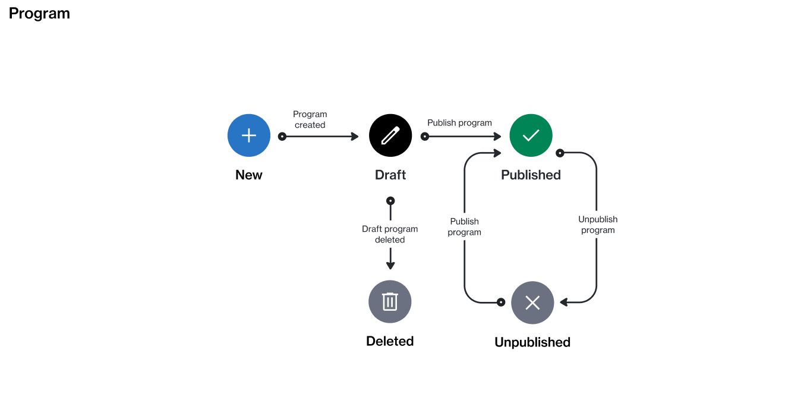

# State Diagram

The following diagram shows the state (status) transition process of a program in the platform. It shows the possible states a program can have and the transition between those states.

<figure><figcaption>
The state transition diagram of a program.
</figcaption></figure>

<table data-full-width="false"><thead><tr><th width="152">State</th><th>Definition</th></tr></thead><tbody><tr><td><strong>New</strong></td><td>This is the initial status, and it's assigned by the platform when the program is created.</td></tr><tr><td><strong>Draft</strong></td><td>The program creation has begun, but it hasn’t been published.</td></tr><tr><td><strong>Published</strong></td><td>The program has been published and it's available in the Marketplace.</td></tr><tr><td><strong>Unpublished</strong></td><td>The program has been unpublished, and it's no longer available for new enrollments in the Marketplace.</td></tr><tr><td><strong>Deleted</strong></td><td>The  program has been deleted.</td></tr></tbody></table>
