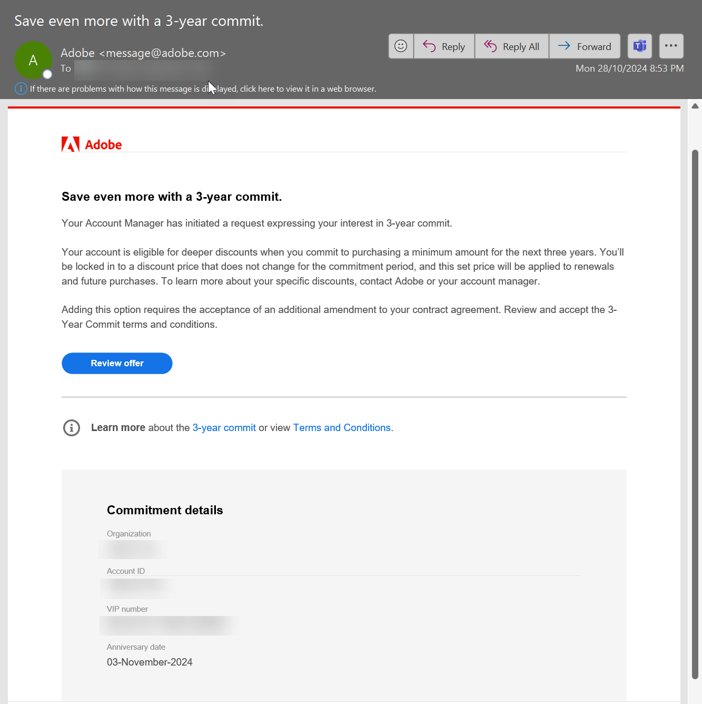
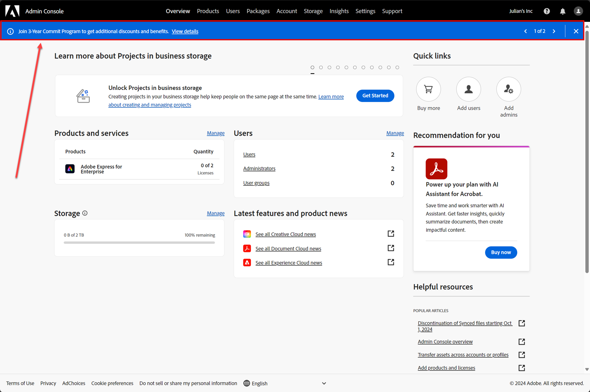
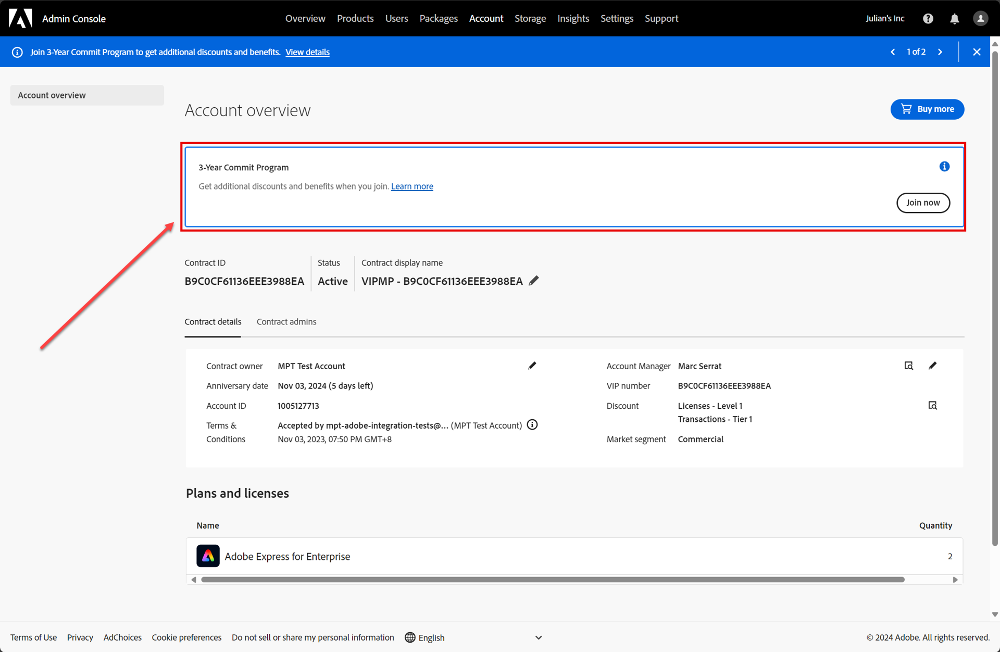

# How do I accept my 3-year commitment invitation?

When SoftwareOne issues your 3-year commitment invitation, you will receive an email from Adobe. The email contains information about the 3-year commitment program.&#x20;

Your Adobe Admin Console administrator must review the details, including terms and conditions, and confirm the acceptance.&#x20;


If you didn't receive the email or have trouble accessing it, you can still complete the acceptance process directly in the Adobe Admin Console. In such cases, skip to step 3 in the following procedure.


**To accept the invitation**

1. Open the 3-year commitment email from Adobe, which is usually sent from message@adobe.com.
2. Select **Review offer**. You'll be directed to the Adobe Admin Console.

<figure><figcaption>
A sample 3-year commit email from Adobe.
</figcaption></figure>

3. Sign in to the console. Then, do one of the following:
   * In the 3-year commit message at the top, select **View details**.&#x20;

<figure><figcaption>
An invitation message in the Admin Console.
</figcaption></figure>

* Go to **Account overview** and select **Join now**.&#x20;

<figure><figcaption>
The Account overview page in the Admin Console.
</figcaption></figure>

4. On the **Accept 3 Year Commit** page:
   1. Under **Accept Terms and Conditions**, select the checkbox to confirm that you have read the terms and conditions.&#x20;
   2. Select **Accept 3 Year Commit**. Note that the option is enabled only after selecting the checkbox.

<figure><figcaption>
Accept 3 year commit page in the Admin Console
</figcaption></figure>

After you have accepted the invitation, we'll update your 3-year commitment details in the Marketplace platform. The product prices are then adjusted according to your qualified discount level.
