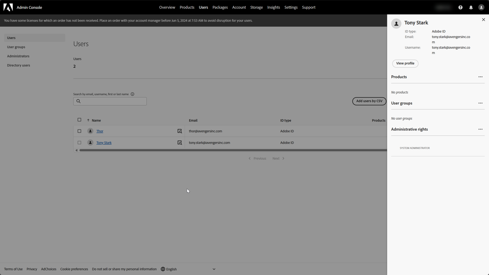
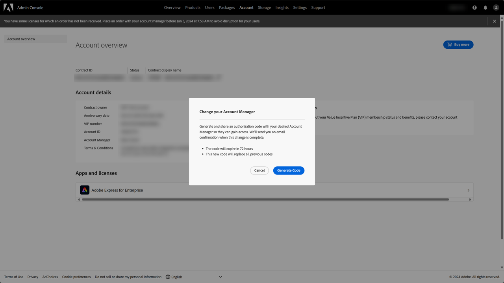
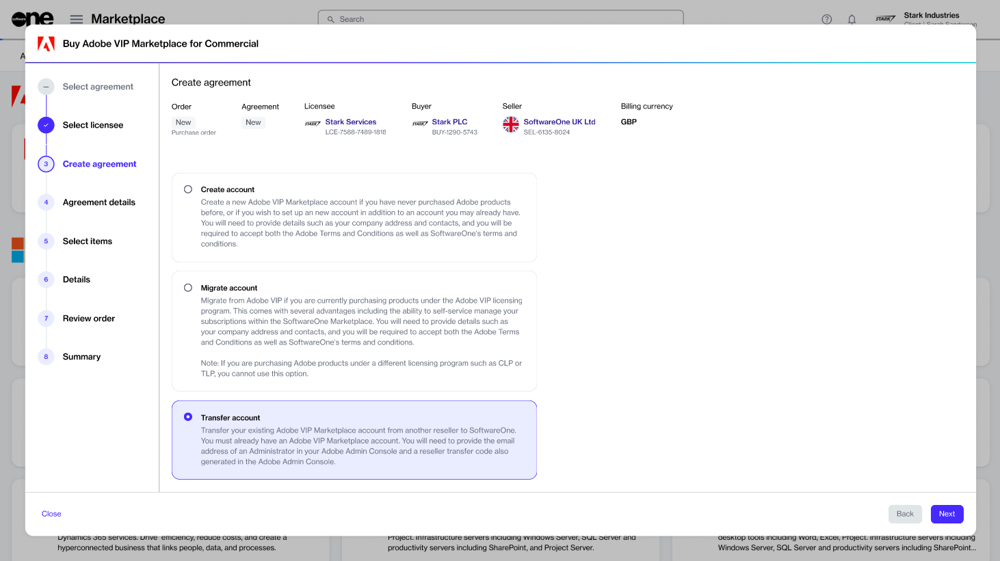
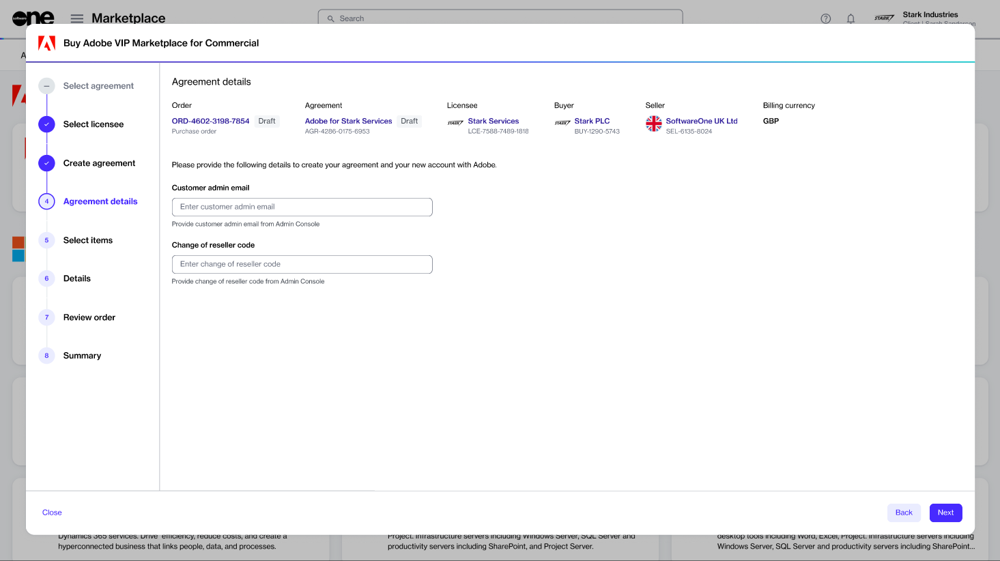

# Transfer Your Adobe Reseller

Adobe allows its VIP Marketplace customers to switch from their current reseller to a new one. This process is called reseller transfer.&#x20;

If you are currently buying Adobe product licenses through a non-SoftwareOne reseller, you can transfer your account to SoftwareOne.&#x20;

When the transfer process completes, SoftwareOne will become your new reseller, managing your Adobe subscriptions and orders.


* Reseller transfers are allowed only for the Adobe VIP Marketplace. Licensing programs such as the Value Incentive Plan (VIP), Cumulative Licensing Program (CLP), Transactional Licensing Program (TLP), and Enterprise Term Licensing Agreement (ETLA) don't permit a change of reseller.
* The Marketplace Platform supports reseller transfers for all supported Adobe VIP Marketplace products, including Commercial, Education, and Government.


## Prerequisites

Before starting the reseller change process, make sure you have the following details from your Adobe Admin Console:

* Your system administrator's email address.&#x20;
* Your reseller change code.&#x20;

How to find the email address of your system administrator


As this process is managed by Adobe, see their official documentation for up-to-date instructions.


1. Sign in to the Admin Console.&#x20;
2. Select the **Users** tab.

<figure><figcaption></figcaption></figure>

3. In the left sidebar, select **Administrators**.
4. Choose any administrator from the list and note their email address.

How to generate an approval or reseller change code


As this process is managed by Adobe, see their official documentation for up-to-date instructions.


1. Sign in to the Admin Console.
2. Navigate to the **Account** tab in the top navigation bar.
3. Under **Account details**, select the edit icon next to the **Account Manager** name.
4. In the **Change your Account Manager** dialog box, select **Generate Code** to generate the approval code.

<figure><figcaption></figcaption></figure>

5. Note the generated code and use it within 72 hours.

## Performing the reseller transfer

You can perform a reseller transfer by creating a new agreement via the Marketplace Platform. All reseller transfers require a new agreement and a new purchase order.&#x20;

To initiate the transfer process:&#x20;

1. Sign in to the Marketplace Platform.
2. Navigate to the **Products** page. Then, select the desired Adobe product, for example, **Adobe VIP Marketplace for Commercial**.
3. On the product details page, select **Buy now**.
4. In the purchase wizard, complete the following steps:
   1. Select **Create agreement**.&#x20;
   2. Choose an existing licensee from the list or [create a new one](../../modules-and-features/settings/licensees/create-licensees.md). Then, select **Next**.
   3.  Choose **Transfer account** and select **Next**.&#x20;

       
<figure><figcaption>
The option to transfer your account.
</figcaption></figure>

   4.  Provide your system administrator's email address and the approval code from the Admin Console. Make sure that the approval code is valid. If the code has expired, you must generate a new one from the Admin Console. Select **Next** to continue.

       
<figure><figcaption>
The options to enter the email address and reseller code.
</figcaption></figure>

   5. Select **Next** to continue to the **Details** step. This current step is view-only, so you can't modify the available item.
   6. Provide optional details, like additional IDs or order notes, and select **Next**.&#x20;
   7. Read the terms and conditions and the privacy statement. When done, select **Place order** to submit your order.
   8. Select **View order** to navigate to the order details page. Otherwise, select **Close** to exit the wizard.

Once we process the order and change the reseller, we will notify you. You can check the status of your order on the [order details ](https://docs.platform.softwareone.com/modules-and-features/marketplace/orders#subscription-details)page.
