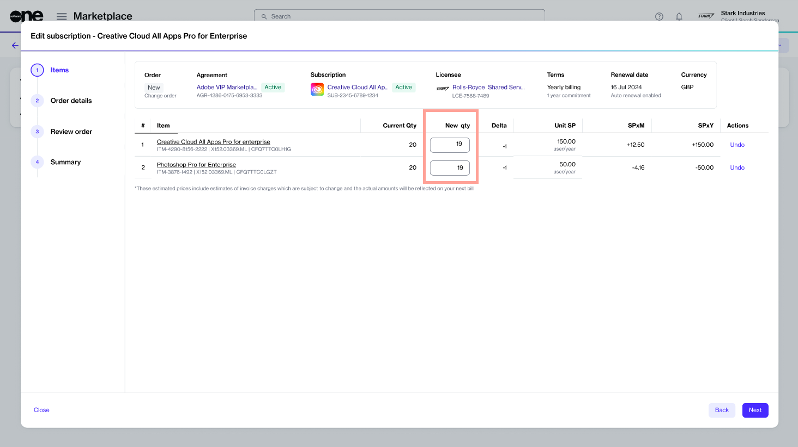

# Downsize Adobe Subscription

If you want to lower the quantity of your Adobe licenses, you can place a change order through the Marketplace Platform. This tutorial shows how you can decrease the quantity of your Adobe licenses.


Adobe offers a 14-day return window. If you decrease the number of licenses within 14 days, SoftwareOne will action your request and update your subscription.

If you are outside the return period, the decrease will only take effect on your renewal date.


## Prerequisites

Before starting this tutorial, make sure that the subscription you want to downsize is in the **Active** state. A subscription in any other state cannot be downsized. See [Subscription States](../../../modules-and-features/marketplace/subscriptions/subscription-states.md) for information on various statuses.

## Downsizing a subscription



**Open the subscription to downsize**

To open the subscription:

1. Navigate to the **Subscriptions** page.
2. Select the required subscription.
3. On the subscription details page, select **Edit** to launch the **Edit subscription** wizard.



**Follow the wizard to change the quantity**

Complete the following steps:

1. **Items** - Enter the new number in the **New qty** field. In the following image, the quantity of both items is lowered from **20** to **19**.

<figure><figcaption>
Items section
</figcaption></figure>

2. **Details** - Enter the reference information that might help you identify the change order easily. You can add the **Additional ID** and **Notes**. Then, select **Next**.
3. **Review** - Read the terms and conditions by selecting the links in the footer. When done, select **Place order**.&#x20;
4. **Summary** - Select **View order** to navigate to the order details page. Otherwise, select **Close**.



## Next steps

Your order is submitted for processing, and the status of your subscription and the agreement changes from **Active** to **Updating**. You won't be able to make any further changes until your order is processed.

You can view the most up-to-date information on your order and its status on the [Order details](../../../modules-and-features/marketplace/orders/#subscription-details) page.
