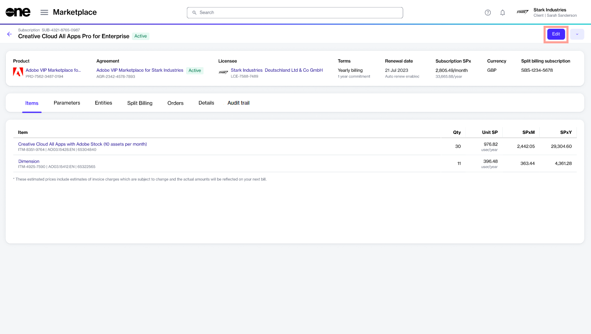
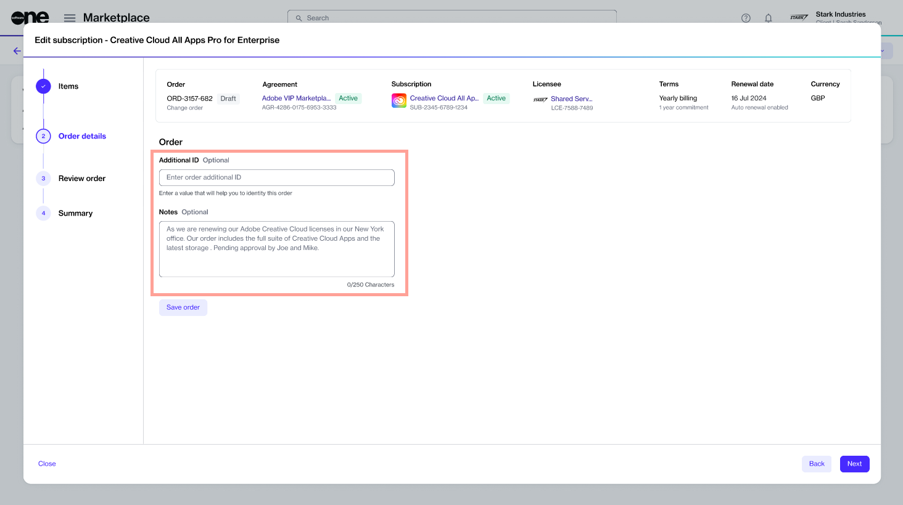
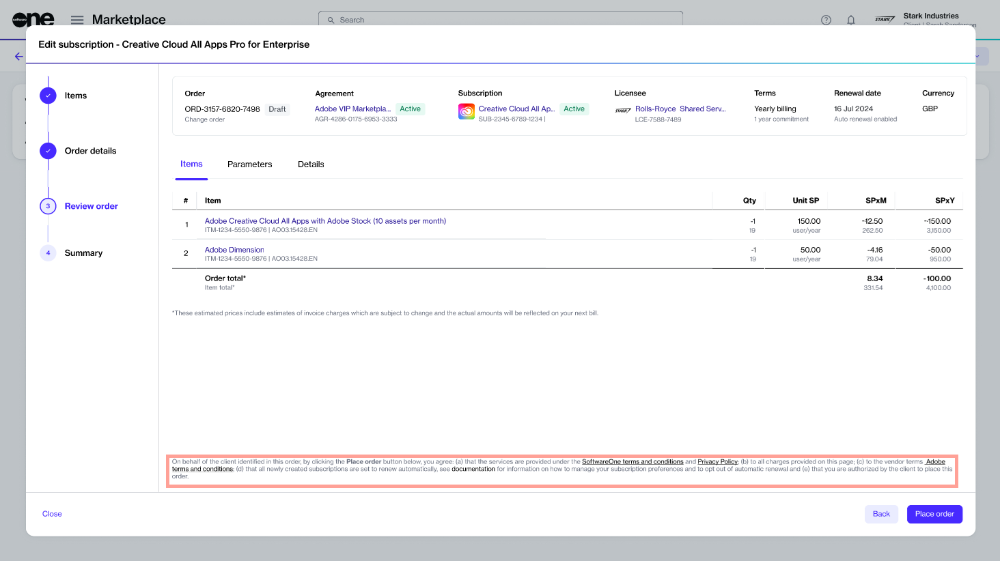
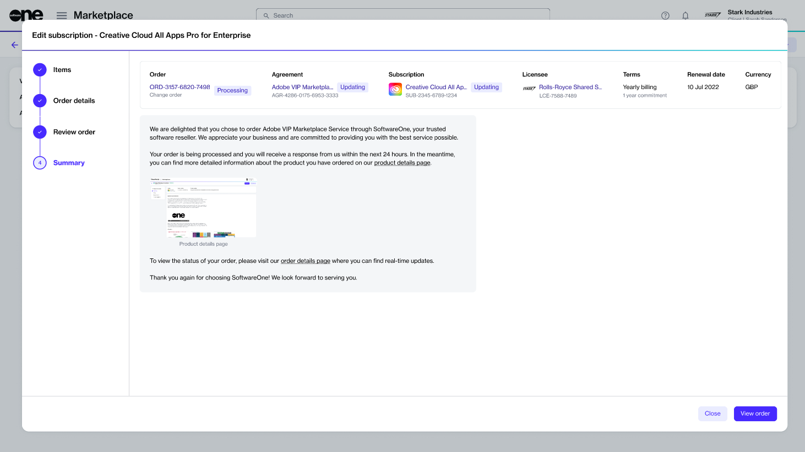

# Downsize Adobe Subscription

If you want to lower the quantity of your Adobe licenses, you can place a change order through the Marketplace Platform. This tutorial shows how you can decrease the quantity of your Adobe licenses.


Adobe offers a 14-day return window. If you decrease the number of licenses within 14 days, SoftwareOne will action your request and update your subscription.

If you are outside the return period, the decrease will only take effect on your renewal date.


## Prerequisites

Before starting this tutorial, make sure that the subscription you want to downsize is in the **Active** state. A subscription in any other state cannot be downsized. See [Subscription States](../../../modules-and-features/marketplace/subscriptions/subscription-states.md) for information on various statuses.

## 1. Open the subscription

1. On the **Subscriptions** page (**Marketplace** > **Subscriptions**), click the required subscription. The following image shows an example subscription:

<figure><figcaption>
Subscriptions page
</figcaption></figure>

2. On the details page of the subscription, click **Edit**.

<figure><figcaption>
Details page
</figcaption></figure>

The **Edit Subscription** wizard launches and the **Items** section of the wizard is displayed.

## 2. Decrease quantity as needed

1. In the **New qty** field, lower the number of licenses. In the following image, the quantity of both items is reduced from **20** to **19**.
2. Click **Next.**

<figure><figcaption>
Items section
</figcaption></figure>

## 3. Enter additional details

1. (Optional) Enter the reference information that might help you identify the change order easily. You can add the **Additional ID** and **Notes**.
2. Click **Next**.

<figure><figcaption>
Order details
</figcaption></figure>

## 4. Place the order

1. Verify the details of your order. Make sure to read the terms and conditions by clicking the links in the footer. By placing the order, you accept all terms.
2. Click **Place order**.

<figure><figcaption>
Review order
</figcaption></figure>

## 5. View order summary

1. Review the order summary and the latest status message.
2. Click **View Order** to navigate to the order details page. Otherwise, click **Close** to close the **Summary** page.

<figure><figcaption>
Order summary
</figcaption></figure>

## Next steps

Your order is submitted for processing and the status of your subscription and the agreement changes from **Active** to **Updating**. You won't be able to make any further changes until your order is processed.

You can view the most up-to-date information on your order and its status on the [Order details](../../../modules-and-features/marketplace/orders/#subscription-details) page.
