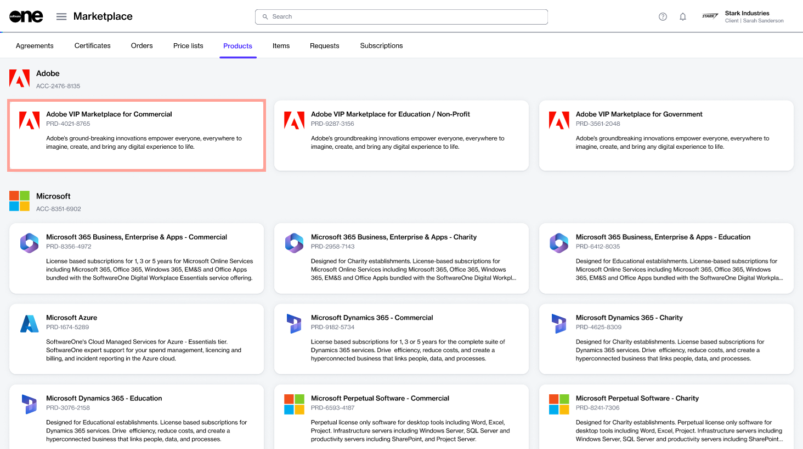
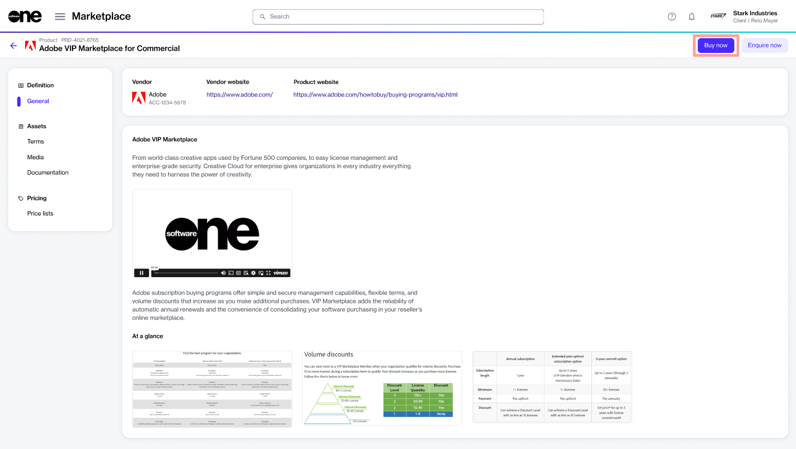
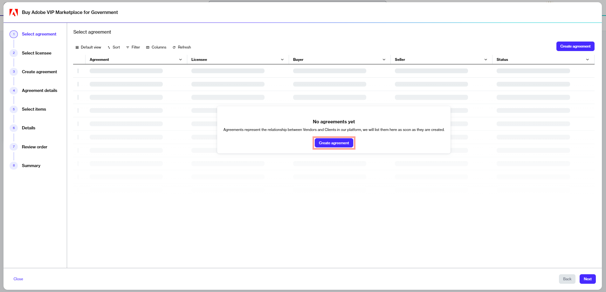
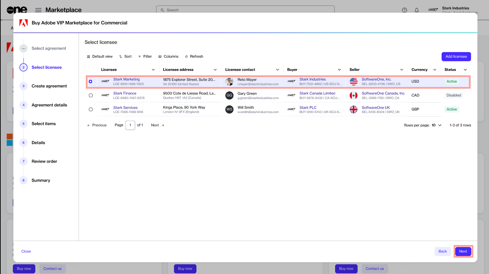
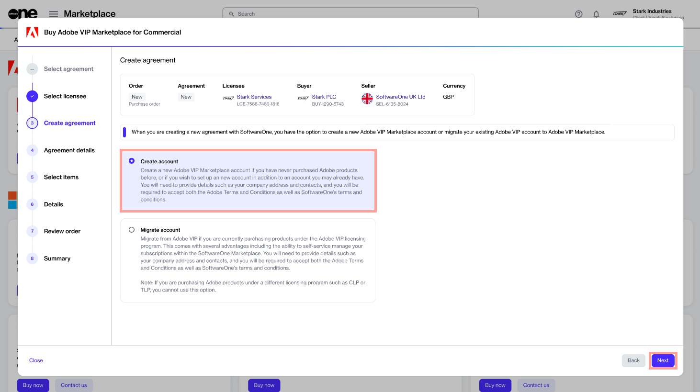
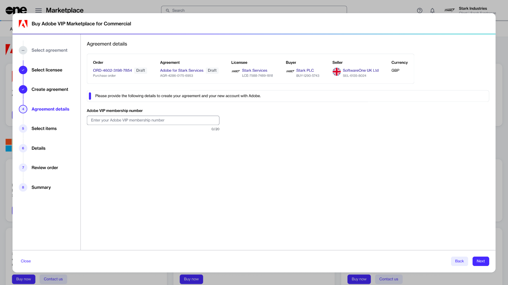
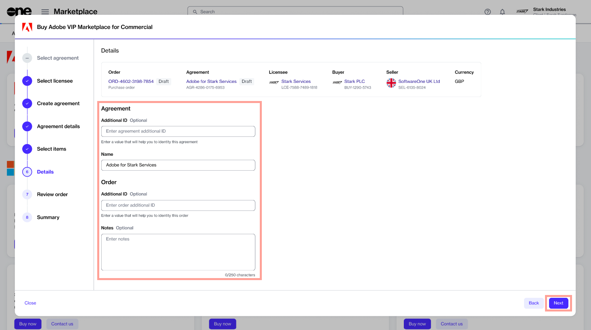
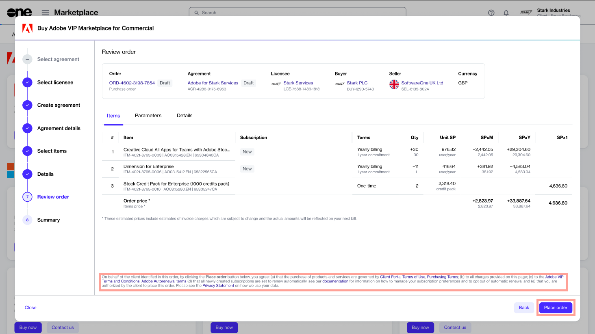

# Order Adobe Subscription

Buying from the Adobe VIP Marketplace buying program means purchasing subscription-based products. You subscribe to these products and pay periodically for their usage.&#x20;

To order a subscription, you must have an agreement. An agreement is a contractual relationship between a seller, buyer, and licensee. Therefore, each ordered subscription is part of an agreement.&#x20;

When you place an order, you either set up a new agreement or add to an existing agreement. This tutorial shows how to order an Adobe subscription by setting up a new agreement and a new Adobe VIP Marketplace account.&#x20;

Watch the following video or continue reading for the step-by-step instructions.&#x20;


Video tutorial: Order an Adobe subscription


## Prerequisites

Before starting this tutorial, make sure you have the following:

* A Marketplace Platform account.
* Your company address and contact information. You must provide this information when creating your Adobe VIP Marketplace account.&#x20;
* An [active licensee](../../../modules-and-features/settings/licensees/licensee-states.md) or permission to [create a new licensee](../../../modules-and-features/settings/licensees/create-licensees.md) (if you don't want to use an existing licensee). You'll need to select the licensee when setting up the agreement.&#x20;

## 1. Launch the purchase wizard

1. From the main menu, navigate to the **Products** page (**Marketplace** > **Products**) and click **Adobe VIP Marketplace for Commercial**.

<figure><figcaption>
Products page
</figcaption></figure>

2. Click **Buy now** in the upper right on the details page.

<figure><figcaption>
Details page of the product
</figcaption></figure>

The purchase wizard starts and the **Select agreement** section of the wizard is displayed.

## 2. Create agreement

Click **Create agreement** to set up your new Adobe agreement. The **Select licensee** section of the wizard is displayed.

<figure><figcaption>
Create agreement option
</figcaption></figure>

## 3. Select licensee

1. Choose the licensee for your agreement. A licensee is the end-user entity of the product being purchased. In this tutorial, we'll select an existing licensee, as shown in the following image. You can also add a new licensee by clicking **Add licensee** and following the steps in [Create Licensee](../../../modules-and-features/settings/licensees/create-licensees.md).
2. Click **Next**.&#x20;

<figure><figcaption>
Select a licensee
</figcaption></figure>

## 4. Choose your account

1. Choose whether to create a new account with Adobe or use your existing account. In this tutorial, we'll create a new account by selecting **Create account**.&#x20;
2. Click **Next**.

<figure><figcaption>
Create account option
</figcaption></figure>

If you want to migrate your existing Adobe VIP account to Adobe VIP Marketplace, select **Migrate account**. If you choose this option, you'll only need to provide your Adobe membership ID in the next step.

## 5. Provide agreement details

Fill out the contact form and click **Next**.

<figure><figcaption>
Agreement details
</figcaption></figure>

* **Company Name** - Enter your company name.&#x20;
* **Address** - Provide your address, including city, state, and zip/postal code.&#x20;
* **Contact** - Provide your contact details.
* **3-year commitment -** Select to apply to a 3-year commitment. For more information, see [3-year commit subscription](https://helpx.adobe.com/uk/enterprise/vip/vip-subscription-term-options-marketplace.html).
* **Minimum licenses -** Enter the minimum number of licenses to commit to.
* **Minimum consumables** - Enter the minimum number of consumables to commit to.

If you are migrating your account, enter your Adobe membership ID.&#x20;

<figure><figcaption>
Membership ID
</figcaption></figure>

## 6. Choose items to order

1. Select the items to order and click **Add items**. You can select multiple items from the list. Once the items are added to your order, the **Select items** section is displayed.

<figure><figcaption>
Select items
</figcaption></figure>

2. Review and adjust the license quantity as needed and click **Next** to continue.

## 7. Provide the reference details

(Optional) Add the additional IDs and notes associated with your agreement and order, and click **Next**.

<figure><figcaption>
Reference details
</figcaption></figure>

## 8. Review and place your order

1. Review the details of your order. Make sure to read the terms and conditions associated with this purchase, including the privacy statement. By placing the order, you accept all terms.
2. Click **Place order** to complete your purchase.

<figure><figcaption>
Review and place your order
</figcaption></figure>

## 9. View order summary

View your order summary and the latest status message. Click **View Order** to navigate to the order details page. Otherwise, click **Close** to close the **Summary** page.

<figure><figcaption>
Order summary
</figcaption></figure>

## Next steps

After placing the order, you'll receive an invitation from Adobe to accept the terms and conditions for Adobe VIP Marketplace.&#x20;

After you’ve accepted the terms and conditions, you’ll be able to manage your licenses and begin deploying them to users immediately in [Adobe Admin Console](https://adminconsole.adobe.com/).
