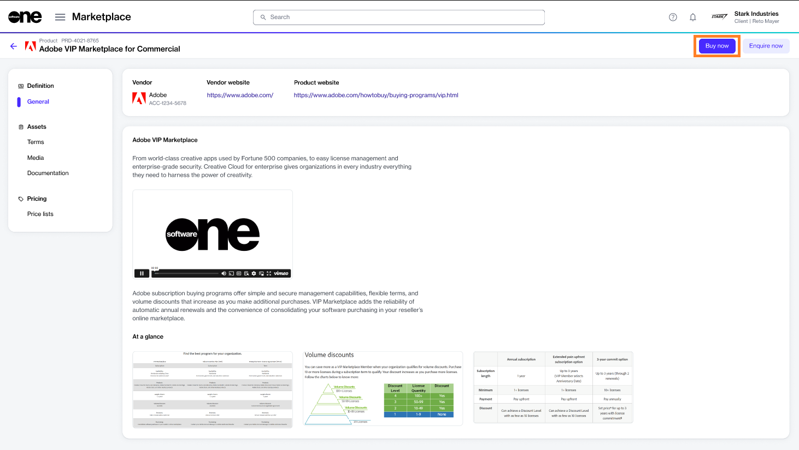
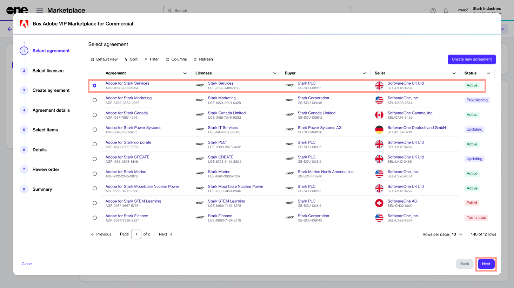
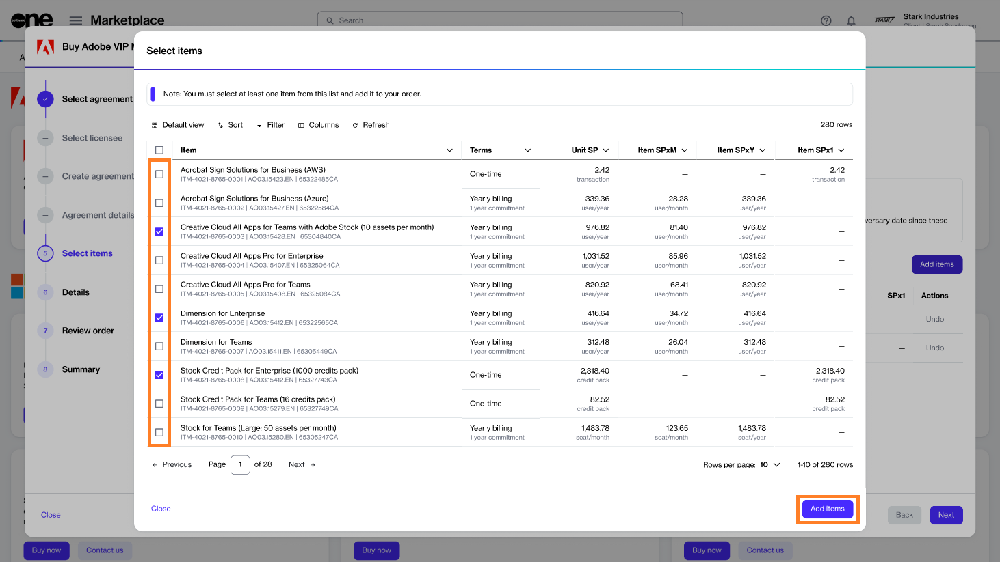
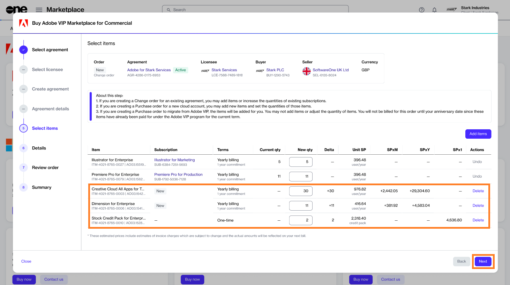
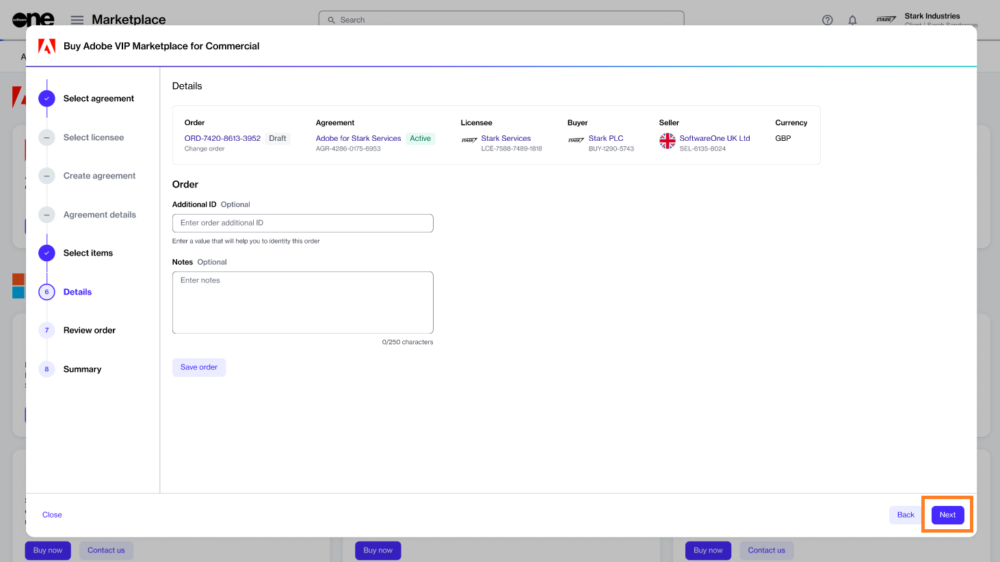

# Order New Adobe Items

If you already have an agreement and want to order new Adobe VIP Marketplace items as part of the same agreement, you can place a change order.&#x20;

This tutorial shows how you can order new items using an existing agreement.&#x20;


Video tutorial: How to order new Adobe items


## Prerequisites

Make sure that the agreement you want to use is **Active**.

## 1**.** Launch the Purchase wizard

1. Navigate to the **Products** page (**Marketplace** > **Products**) and click **Adobe VIP Marketplace for Commercial**.

<figure><figcaption>
Products page
</figcaption></figure>

2. Click **Buy now** on the details page.

<figure><figcaption>
Details page
</figcaption></figure>

The purchase wizard starts and the **Select agreement** section of the wizard is displayed.

## 2. Select agreement

1. Select the agreement you want to use. Make sure that the agreement is **Active**. The following image shows an example.
2. Click **Next**.

<figure><figcaption>
Select agreement
</figcaption></figure>

When you click **Next**, the **Select Items** section of the wizard is displayed directly. All other sections are skipped by default because the details are fetched from your agreement.&#x20;

<figure><figcaption>
Select items
</figcaption></figure>

## 3. Add new items

1. On the **Select items** page, click **Add items**.&#x20;
2. Select the new items and click **Add items**. You can choose multiple items at once. The following image shows an example:

<figure><figcaption>
Add items
</figcaption></figure>

3. When adding new items, adjust the quantity as needed in the **New qty** field and click **Next**.

<figure><figcaption>
Update quantity
</figcaption></figure>

## 4. Provide agreement and order details

1. (Optional) Enter the required details so you can easily identify the agreement and order.&#x20;
2. Click **Next**.

<figure><figcaption>
Order details
</figcaption></figure>

## 5. Place your order

Review the details of your change order and click **Place order** to complete your purchase.

<figure><figcaption>
Review order
</figcaption></figure>

## 6. View your order summary

1. View your order summary and the latest status message.&#x20;
2. Click **View Order** to navigate to the order details page. Otherwise, click **Close** to close the **Summary** page.

<figure><figcaption>
Order summary 
</figcaption></figure>

## Next steps

Your change order is submitted for processing.

You can view the most up-to-date information on your order and its status on the [Order details](../../../platform-modules/marketplace/orders/orders-interface.md#subscription-details) page.
