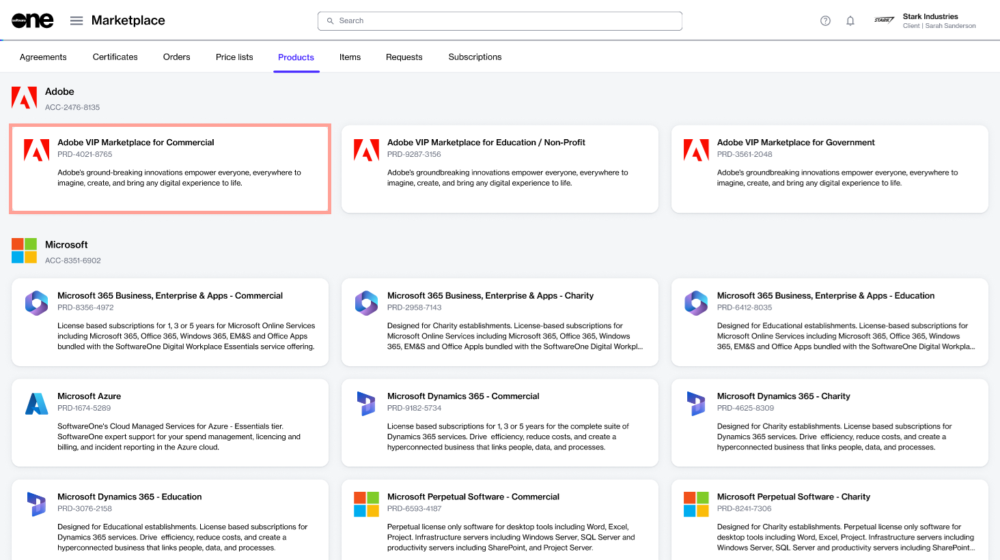

# Order New Adobe Items

If you already have an agreement and want to order new Adobe VIP Marketplace items as part of the same agreement, you can place a change order.&#x20;

This tutorial shows how to order new items using an existing agreement. Watch the following video or continue reading for the step-by-step instructions.&#x20;


Video tutorial: How to order new Adobe items


## Prerequisites

Before starting this tutorial, make sure that the agreement you want to use is in the **Active** state.&#x20;

Agreements in any other state cannot be used when ordering items. See [Agreement States](../../../modules-and-features/marketplace/agreements/agreement-states.md) for information on various statuses.&#x20;

## &#x31;**.** Launch the purchase wizard

1. From the main menu, navigate to the **Products** page (**Marketplace** > **Products**) and click **Adobe VIP Marketplace for Commercial**.

<figure><figcaption>
Products page
</figcaption></figure>

2. Click **Buy now** in the upper right on the details page.

<figure><figcaption>
Details page of the product
</figcaption></figure>

The purchase wizard starts and the **Select agreement** section of the wizard is displayed.

## 2. Select the agreement

Select the agreement you want to use for this order and click **Next**. Make sure that the agreement is **Active**.&#x20;

<figure><figcaption>
Select agreement
</figcaption></figure>

The wizard displays the **Select Items** section. Other sections are skipped because the information in those sections is retrieved from your selected agreement.

## 3. Select items to order

1. On the **Select items** page, click **Add items**.

<figure><figcaption>
Select items
</figcaption></figure>

2. Choose the items you want to order and click **Add items**. You can choose multiple items from the list.

<figure><figcaption>
Select items
</figcaption></figure>

3. In the **New qty** field, adjust the number of licenses as required and click **Next**.

<figure><figcaption>
Select items
</figcaption></figure>

## 4. Add reference details

(Optional) Enter the reference details for the order and click **Next**. You can use this page to add information that might help you identify the order easily.

<figure><figcaption>
Order details
</figcaption></figure>

## 5. Place your order

Review the order details and click **Place order** to complete the purchase.

<figure><figcaption>
Review order
</figcaption></figure>

## 6. See your order summary

View your order summary and the latest status message. Click **View Order** to navigate to the order details page. Otherwise, click **Close** to close the **Summary** page.

<figure><figcaption>
Order summary 
</figcaption></figure>

## Next steps

Your change order is submitted for processing.

You can view the most up-to-date information on your order and its status on the [Order details](../../../modules-and-features/marketplace/orders/#subscription-details) page.
