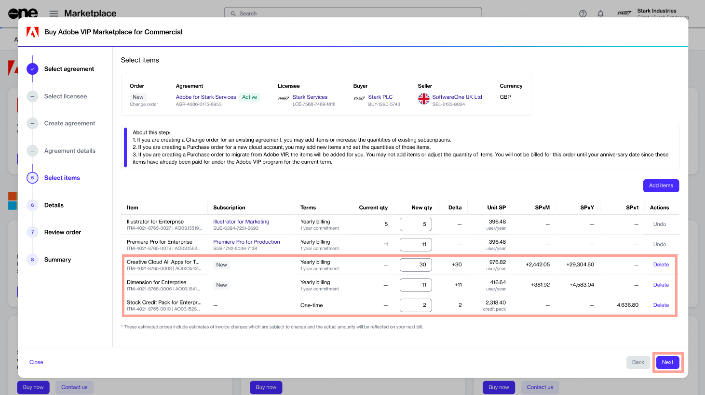

# Order New Adobe Items

If you already have an agreement and want to order new Adobe VIP Marketplace items as part of the same agreement, you can place a change order.&#x20;

This tutorial shows how to order new items using an existing agreement. Watch the following video or continue reading for the step-by-step instructions.&#x20;


Video tutorial: How to order new Adobe items


## Prerequisites

Before starting this tutorial, make sure that the agreement you want to use is in the active state. Agreements in any other state cannot be used when ordering subscriptions.&#x20;

## Ordering new Adobe items





To start the process:

1. Navigate to the **Products** page.
2. Select **Adobe VIP Marketplace for Commercial**.
3. On the details page, select **Buy now**.







1. In the **Create agreement** step, choose an active agreement from the list. Then, select **Next**. All items that you have ordered under this agreement are displayed.
2. In the **Select Items** step, select **Add items** to add the new items to this agreement.

<figure><figcaption>
Select items to order
</figcaption></figure>

3. Choose the items to order. You can choose multiple items from the list. When done, select **Add items**.&#x20;
4. In the **New qty** field, adjust the quantity of licenses. Select **Next**.&#x20;

<figure><figcaption>
Select items step
</figcaption></figure>

5. In the **Details** step, provide reference details, including additional IDs or notes, and select **Next**.
6. In the **Review order** step, read the terms and conditions and the privacy statement. When done, select **Place order**.
7. In the **Summary** step, select **View details** to go to the order details page. Otherwise, select **Close**.



## Next steps

Your change order is submitted for processing.

You can view the most up-to-date information on your order and its status on the [Order details](../../../modules-and-features/marketplace/orders/#subscription-details) page.
