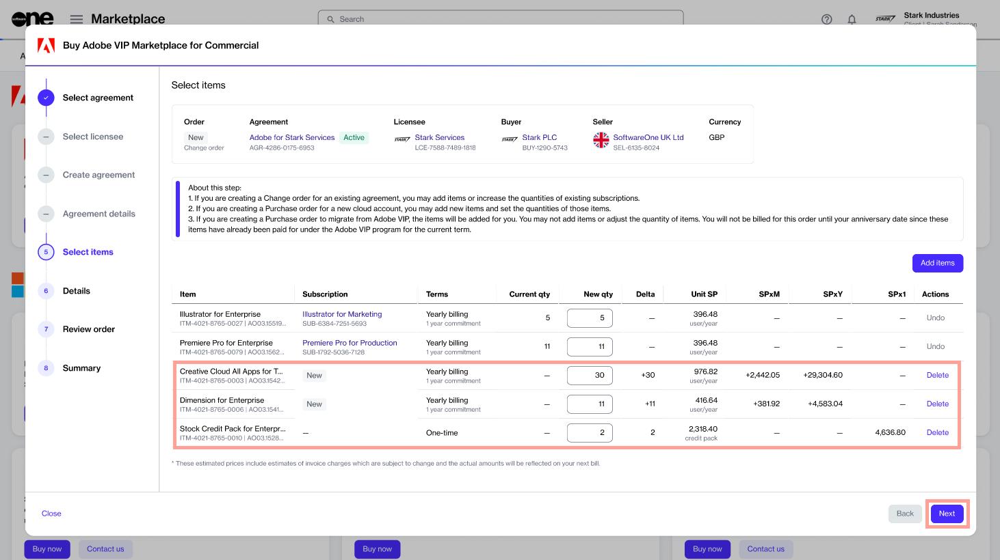

# Buy new Adobe items

This tutorial explains how to add new items to your existing Adobe VIP Marketplace agreement with SoftwareOne by placing a change order.


Watch a quick video guide how to order new Adobe items using an existing agreement.


### Prerequisites

Make sure the agreement you want to use is active.&#x20;

### Ordering new Adobe items



**Start the ordering process**

To start the order:

1. Go to **Catalog** > **Products**.
2. Select the required Adobe product, for example, **Adobe VIP Marketplace for Commercial**.
3. Review the product details.
4. Select **Buy now**.



**Add the items to your order**

In the guided purchase flow, complete the following steps:

1. **Select agreement** – Select the required active agreement, then select **Next**.&#x20;
2. **Select Items** – Do the following:
   1. Select **Add items**.
   2. &#x20;Add the required items to your order.&#x20;
   3. Update the quantity in the **New qty** field.
   4. Select **Next**.

<figure><figcaption>
The Select items step displaying newly added items.
</figcaption></figure>




**Review and submit the order**

1. **Details** – Add or update the reference ID and order notes. Select **Next**.
2. **Review order** – Review the order details, go through the terms and conditions, then select **Place order**.
3. **Summary** – Review your order summary, then select **View details** to open the order details page, or select **Close**.



### Next steps

After you place the order, a change order is created for the agreement.

The agreement status also changes from **Active** to **Updating**. While the agreement is updating, you cannot place more orders under that agreement.

You can track the order on the **Orders** page or in the **Orders** tab on the agreement details page.

