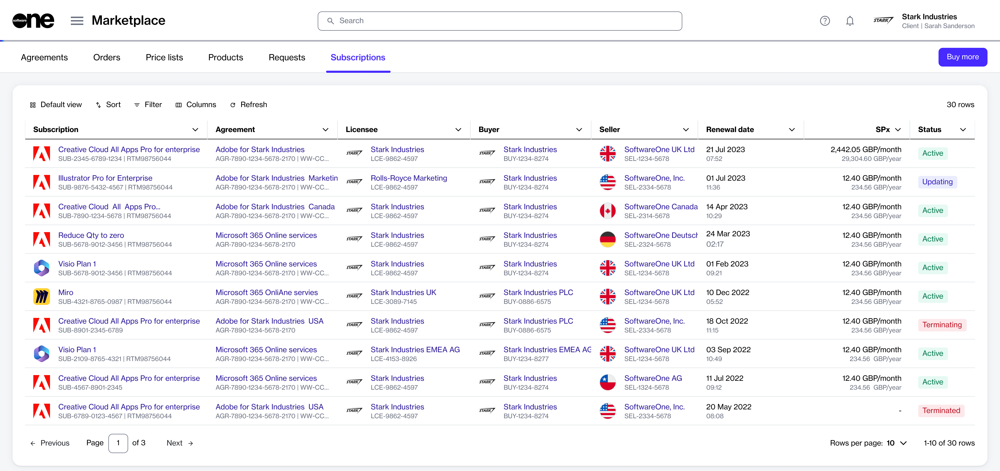
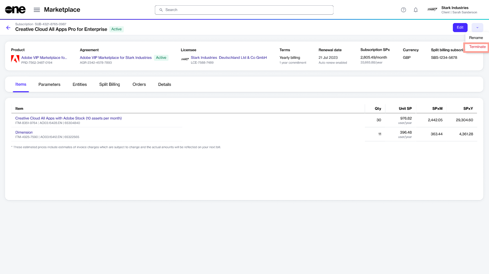
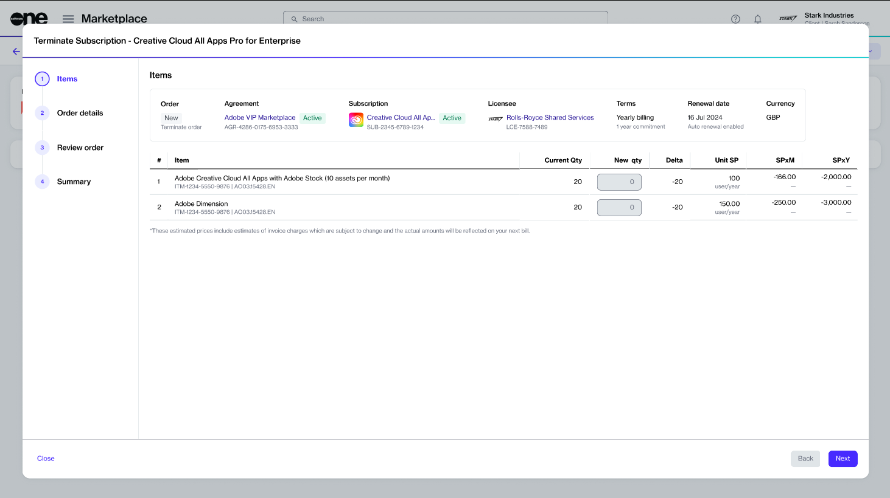
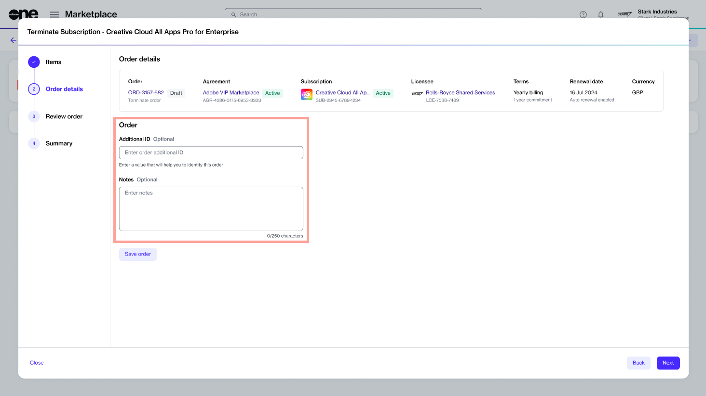
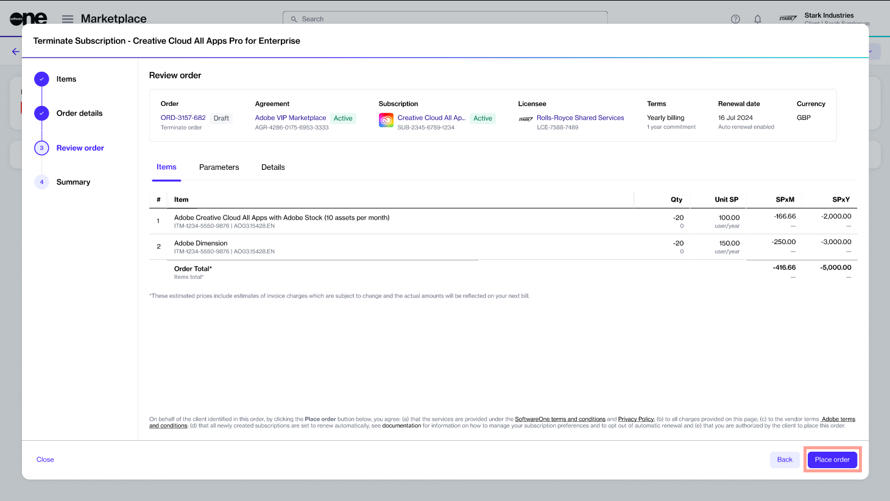

# Terminate Adobe Subscription

If you want to cancel your Adobe subscriptions within the 14-day return period, or if you are beyond this period and want to prevent your subscription from automatically renewing on the renewal date, you'll need to create a termination order.&#x20;

Adobe subscriptions can be terminated both within and outside the 14-day return period. To learn about the cancellation policies, see [What happens if I terminate my Adobe subscription?](../faqs/what-happens-if-i-terminate-my-adobe-subscription.md)

## Prerequisites 

Before starting this tutorial, make sure that your subscription has **Active** status.&#x20;

## 1. Open the subscription

1. On the **Subscriptions** page (**Marketplace** > **Subscriptions**), click the subscription to terminate. The following image shows an example:

<figure><figcaption>
Subscriptions page
</figcaption></figure>

2. Click the chevron in the upper right on the details page and select **Terminate**.  The **Terminate subscription** wizard launches.

<figure><figcaption>
Terminate option on the details page
</figcaption></figure>

## 2. Place the termination order

1. Verify that the quantity of the subscription you want to terminate is zero. Click **Next**.

<figure><figcaption>
Verify the subscription quantity
</figcaption></figure>

2. Enter the reference information for the order and click **Next**. You can enter the additional ID and any notes associated with this termination.

<figure><figcaption>
Order details
</figcaption></figure>

3. Click **Place Order** to finalize the cancellation.

<figure><figcaption>
Review order
</figcaption></figure>

4. Click **View Order** to navigate to the order details page. Otherwise, click **Close** to close the **Summary** page.

## Next steps

Your termination order is submitted to the vendor for processing.&#x20;

You can view the most up-to-date information on your order and its status on the [Order details](../../../modules-and-features/marketplace/orders/#subscription-details) page.
