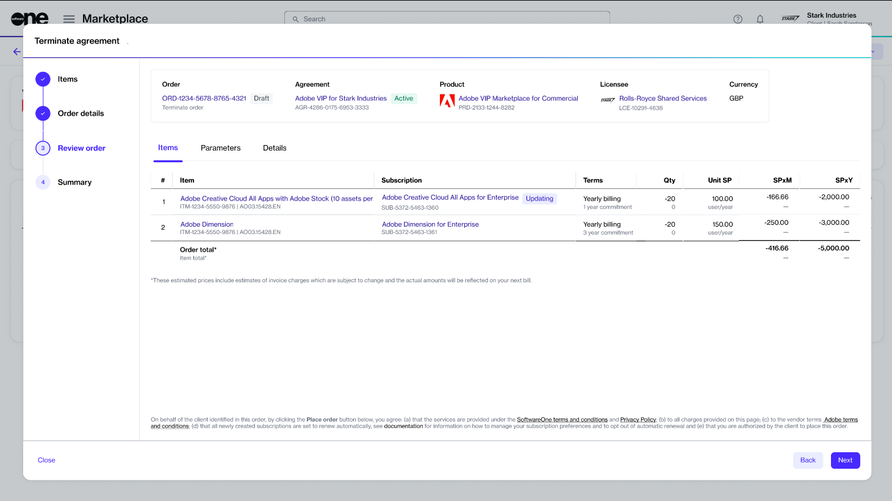

# Terminate All Adobe Subscriptions

If you want to cancel all subscriptions in an agreement, you'll need to terminate the agreement altogether. An agreement can be terminated by placing a termination order. In this tutorial, you'll learn how to create a termination order for the agreement.

Note that Adobe subscriptions can be terminated both within and outside the 14-day return period. To learn about the cancellation policies, see [What happens if I terminate my Adobe subscription?](../faqs/what-happens-if-i-terminate-my-adobe-subscription.md)

## Prerequisites

Before starting this tutorial, make sure that the agreement you want to terminate is **Active**. Agreements in any other [state ](../../../modules-and-features/marketplace/agreements/agreement-states.md)cannot be terminated.

## 1. Open the agreement

1. On the **Agreements** page (**Marketplace** > **Agreements**), click the agreement you want to terminate.&#x20;

<figure><figcaption>
Agreements page
</figcaption></figure>

2. On the details page, click the down arrow <path d=&#x22;M480-344 240-584l56-56 184 184 184-184 56 56-240 240Z&#x22;/></svg>" data-size="line">in the upper right and select **Terminate**.&#x20;

<figure><figcaption>
Details page of the agreement
</figcaption></figure>

## 2. Place the termination order

1. Verify that the **New qty** field displays the subscription quantity as 0 (zero). Then, click **Next**.

<figure><figcaption></figcaption></figure>

2. Enter the additional ID and notes associated with this termination. Click **Next** to continue.

<figure><figcaption>
Order details
</figcaption></figure>

3. Click **Next** to place the termination order for the agreement.&#x20;

<figure><figcaption>
Review order
</figcaption></figure>

4. Click **View Order** to navigate to the order details page. Otherwise, click **Close** to close the **Summary** page.

<figure><figcaption>
Order summary
</figcaption></figure>

## Next steps

Your termination order is submitted to the vendor for processing.

You can view the most up-to-date information on your order and its status on the [Order details](../../../modules-and-features/marketplace/orders/#subscription-details) page.
