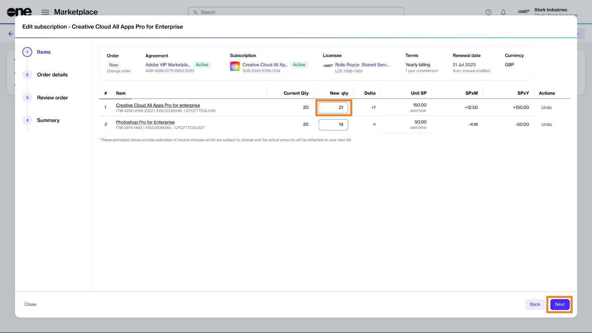

# Upsize Adobe Subscription

If you need to increase the licenses for your Adobe subscription, you can place a change order through the Marketplace Platform.&#x20;

There are two ways to increase the number of licenses. The first is by increasing the quantity directly within the subscription, and the second is through the Purchase wizard.&#x20;

This tutorial shows how to order additional licenses by editing the subscription. You can watch the following video or continue reading for the step-by-step instructions.&#x20;


Video tutorial: How to increase your Adobe subscription licenses


## Prerequisites

Before starting this tutorial, ensure that your Adobe agreement and the subscription are in the **Active** state.

## 1. Open the subscription

1. Navigate to the **Subscriptions** page (**Marketplace** > **Subscriptions**) and click the subscription you want to use. The following shows an example:

<figure><figcaption>
Subscriptions page
</figcaption></figure>

2\. Click **Edit** on the details page of your selected subscription.

<figure><figcaption>
Details page
</figcaption></figure>

The **Edit subscription** wizard launches and the **Items** section of the wizard displays.

## 2. Increase the quantity as needed

1. Specify the new quantity in the **New qty** field. In the following image, the quantity is increased from **20** to **21**.
2. Click **Next** to continue.

<figure><figcaption>
Adobe items
</figcaption></figure>

## 3. Enter reference information

1. (Optional) Enter the optional reference information so you can identify the change order easily.&#x20;
2. Click **Next** to continue.

<figure><figcaption>
Order details
</figcaption></figure>

## 4. Place your order

1. Verify the details of your change order. Make sure to read the terms and conditions by clicking the links in the footer. By placing the order, you accept all terms.
2. Click **Place order**.&#x20;

<figure><figcaption>
Review order
</figcaption></figure>

## 5. View order summary

1. Review your order summary and the latest status message.&#x20;
2. Click **View Order** to navigate to the order details page. Otherwise, click **Close** to close the **Summary** page.

<figure><figcaption>
Order summary
</figcaption></figure>

## Next steps

Your order is submitted for processing, and the status of your subscription and the associated agreement changes from **Active** to **Updating**.&#x20;

You won't be able to make any further changes until your change order is processed. You can view the most up-to-date information on your order and its status on the [Order details](../../../platform-modules/marketplace/orders/orders-interface.md#subscription-details) page.
