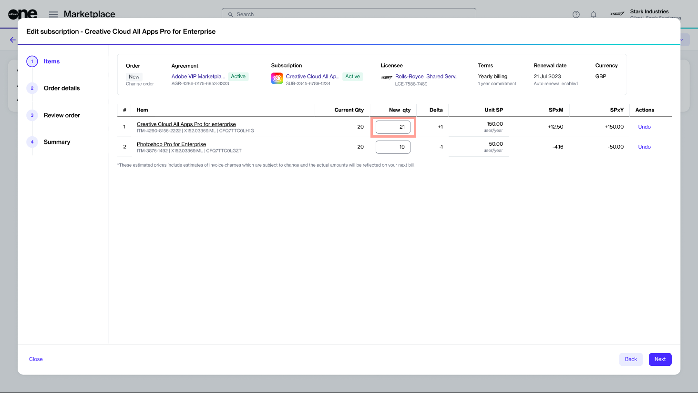

# Upsize Adobe Subscription

If you need to increase the number of licenses for your Adobe subscription, you can place a change order through the Marketplace Platform.

There are two ways to add additional licenses:

1. By directly increasing the quantity within your current subscription.
2. Through the Purchase Wizard.

In this tutorial, you'll learn how to increase licenses using the first method. Watch the video below or continue reading for step-by-step instructions.


Video tutorial: How to increase your Adobe subscription licenses


## Prerequisites

Before starting this tutorial, make sure that your Adobe agreement and the subscription are in the **Active** state.

## Upsizing a subscription



**Open the subscription to upsize**

To open the subscription:

1. Navigate to the **Subscriptions** page.
2. Select the required subscription.
3. On the subscription's details page, select **Edit** to launch the **Edit subscription** wizard.



**Follow the wizard to increase the quantity**

Complete the following steps:

1. **Items** - Enter the new quantity in the **New qty** field, then select **Next**. In the following image, the quantity is increased from **20** to **21**.&#x20;

<figure><figcaption>
Edit the quantity of licenses
</figcaption></figure>

2. **Details** - Enter the reference information as needed and select **Next**.
3. **Review** - Select **Place order** to place your termination order for the subscription.
4. **Summary** - Select **View order** to navigate to the order details page. Otherwise, select **Close**.



## Next steps

Your order is submitted for processing, and the status of your subscription and the associated agreement changes from **Active** to **Updating**.

You won't be able to make any further changes until your change order is processed. You can view the most up-to-date information on your order and its status on the [Order details](../../../modules-and-features/marketplace/orders/#subscription-details) page.
