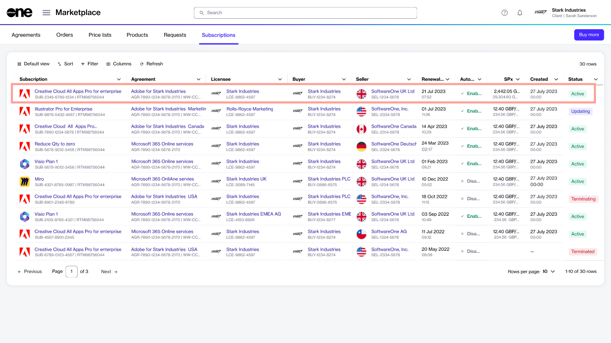

# Upsize Adobe Subscription

If you need to increase the number of licenses for your Adobe subscription, you can place a change order through the Marketplace Platform.

There are two ways to add additional licenses:

1. By directly increasing the quantity within your current subscription.
2. Through the Purchase Wizard.

In this tutorial, you'll learn how to increase licenses using the first method. Watch the video below or continue reading for step-by-step instructions.


Video tutorial: How to increase your Adobe subscription licenses


## Prerequisites

Before starting this tutorial, make sure that your Adobe agreement and the subscription are in the **Active** state.

## 1. Open the subscription

1. On the **Subscriptions** page (**Marketplace** > **Subscriptions**), click the subscription you want to update. The following image shows an example subscription:

<figure><figcaption>
Subscriptions page
</figcaption></figure>

2. On the details page of the subscription, click **Edit**.

<figure><figcaption>
Details page
</figcaption></figure>

The **Edit subscription** wizard launches and the **Items** section of the wizard is displayed.

## 2. Increase the quantity

1. Enter the new quantity for the subscription in the **New qty** field. In the following image, the quantity is increased from **20** to **21**.
2. Click **Next** to continue.

<figure><figcaption>
Edit quantity
</figcaption></figure>

## 3. Enter reference information

1. (Optional) Enter the reference information associated with this order.
2. Click **Next** to continue.

<figure><figcaption>
Order details
</figcaption></figure>

## 4. Place your order

1. Verify the details of your change order. Make sure to read the terms and conditions by clicking the links in the footer. By placing the order, you accept all terms.
2. Click **Place order**.

<figure><figcaption>
Place your order
</figcaption></figure>

## 5. View order summary

1. Review your order summary and the latest status message.
2. Click **View Order** to navigate to the order details page. Otherwise, click **Close** to close the **Summary** page.

<figure><figcaption>
Order summary
</figcaption></figure>

## Next steps

Your order is submitted for processing, and the status of your subscription and the associated agreement changes from **Active** to **Updating**.

You won't be able to make any further changes until your change order is processed. You can view the most up-to-date information on your order and its status on the [Order details](../../../modules-and-features/marketplace/orders/#subscription-details) page.
