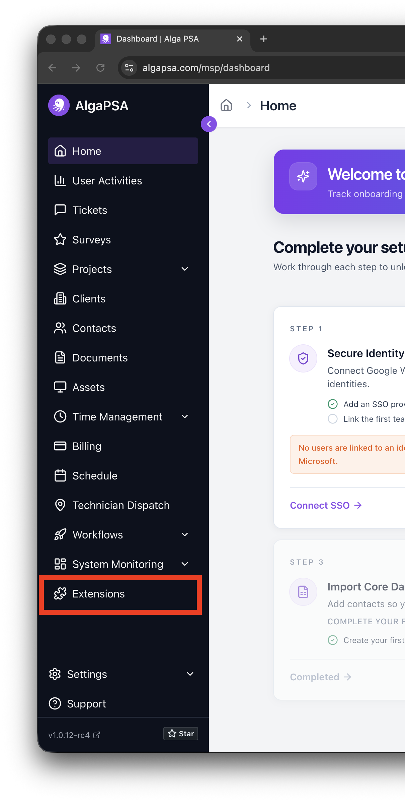
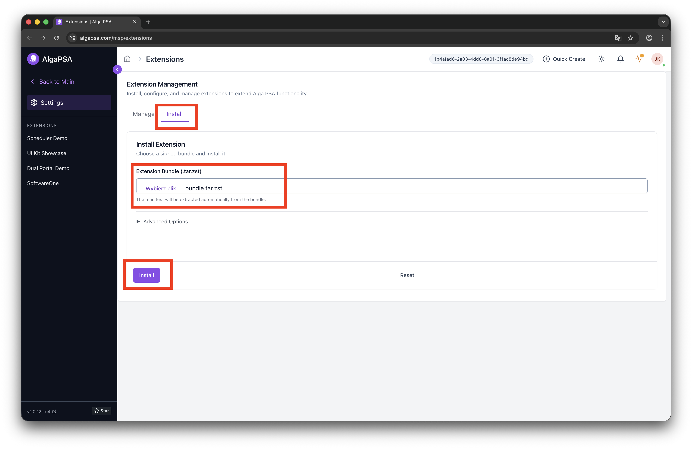
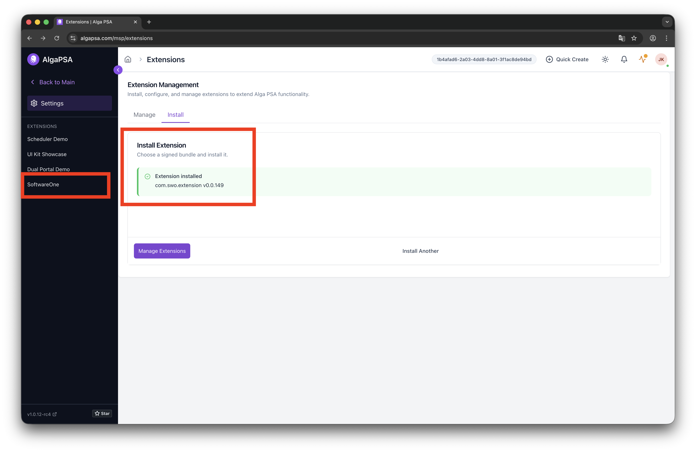
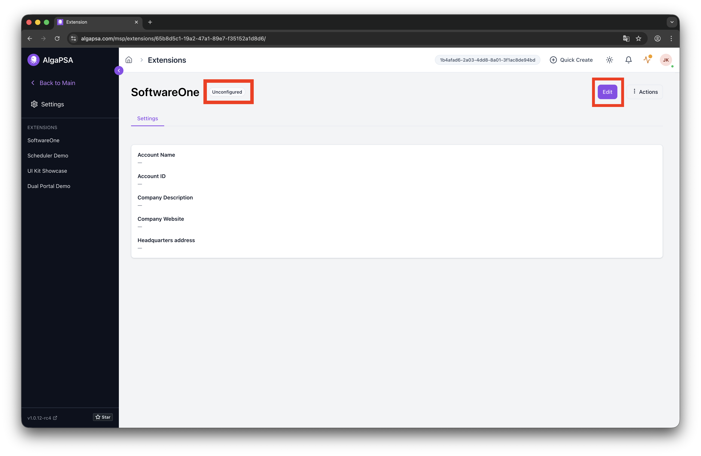
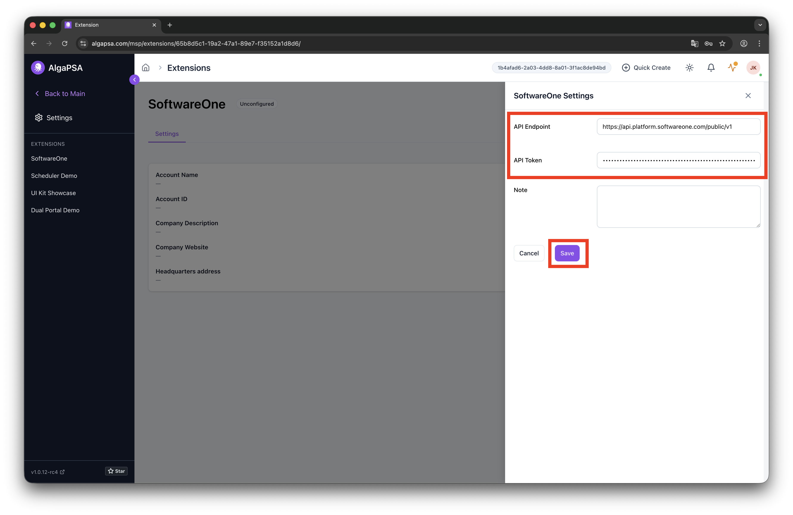
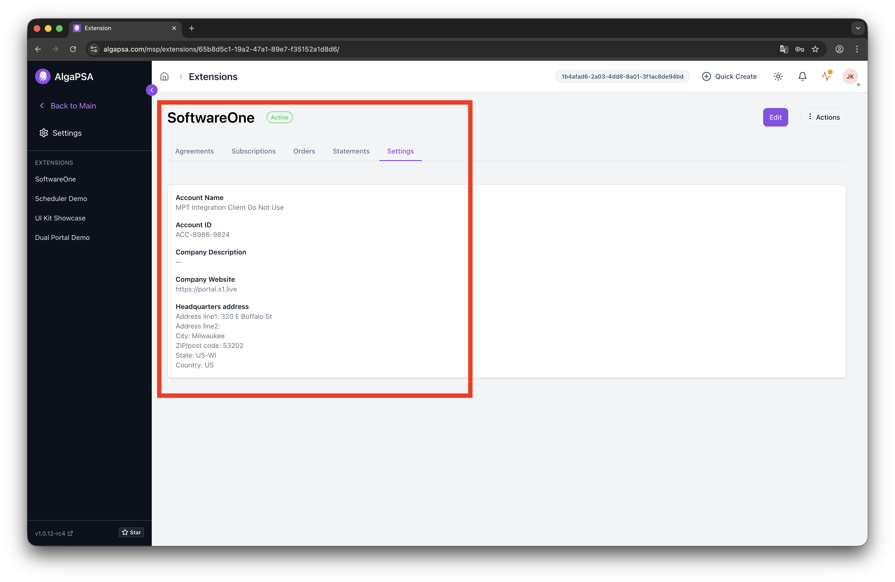

# Install the SoftwareOne extension

This topic describes how to install the SoftwareOne extension to connect Alga PSA to the SoftwareOne Marketplace.&#x20;

By installing this extension, you can bring data, such as agreements, subscriptions, and orders, directly from SoftwareOne Marketplace into Alga PSA.

### Prerequisites

Before you begin, ensure that you have the following:

* Access to the [Alga PSA MSP Portal](https://algapsa.com/).
* The extension bundle file (`bundle.tar.zst`). You can download this file from [GitHub - SoftwareOne Extension Bundle](https://github.com/softwareone-platform/alga-extension/blob/main/docs/installation/bundle.tar.zst).
* A SoftwareOne Marketplace API token, which you can generate in the [Marketplace Platform](https://portal.platform.softwareone.com/). For details, see [Create API tokens](../../modules-and-features/settings/api-tokens/create-api-token.md).

### Installing the SoftwareOne extension

To install the SoftwareOne extension:

1. Sign in to Alga PSA.
2. In the left sidebar, go to **Extensions**.

<figure><figcaption>
Navigate to Extensions in Alga PSA.
</figcaption></figure>

3. Select the **Install** tab. In the **Extension Bundle** field, upload the extension bundle file (`bundle.tar.zst`) and select **Install**.

<figure><figcaption>
Upload and install the extension bundle.
</figcaption></figure>

4. Wait for the installation to complete. Once finished, in the left sidebar, under **Extensions**, verify that **SoftwareOne** is listed.&#x20;

<figure><figcaption>
Verify the installed extension.
</figcaption></figure>

5. Select the installed **SoftwareOne** extension, then select **Edit** to configure it. The initial configuration status is displayed as **Unconfigured**.&#x20;

<figure><figcaption>
Configure the extension settings.
</figcaption></figure>

6. Under **SoftwareOne Settings**, do the following:
   1. Provide the API credentials:
      * **API Endpoint** - `https://api.platform.softwareone.com/public/v1`
      * **API Token** - Paste the token generated in the SoftwareOne Marketplace.
   2. Select **Save** to apply the configuration.

<figure><figcaption>
Provide API credentials.
</figcaption></figure>

7. Confirm that the extension is active and its status has changed from **Unconfigured** to **Active**.

<figure><figcaption>
Confirm that the extension is active.
</figcaption></figure>

### Next steps

Once you have installed and configured the SoftwareOne extension, you can view your account details on the **Settings** tab in Alga PSA, along with your agreements, subscriptions, orders, and statements under their respective tabs.
