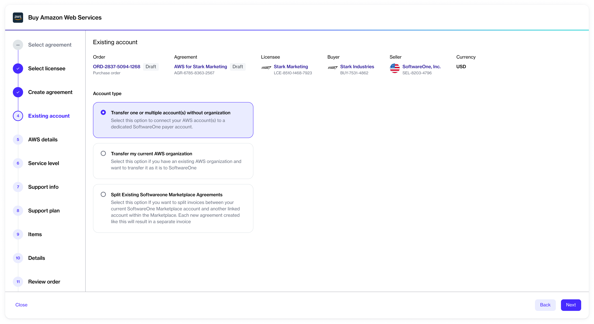

# Account Options

When you are ordering AWS services through the SoftwareOne Marketplace, you can either create a new AWS account or transfer the management of your existing accounts to SoftwareOne.&#x20;

## New AWS account

Creating a new AWS account means you want to sign up for AWS through SoftwareOne and use the account that SoftwareOne creates for you. When you sign up for AWS through SoftwareOne, you will be connecting your linked accounts to a dedicated SoftwareOne-owned payer account.

To sign up for AWS through the Marketplace Platform, you'll need to provide the following details:

* Your root user email address
* AWS account name

We'll use these details to set up your account. Once your account has been configured, you can start deploying and managing your AWS resources.

## Existing AWS account

If you are an existing AWS customer and want to transfer your existing account to SoftwareOne, we offer the following transfer options:

<figure><figcaption>
AWS account type options
</figcaption></figure>

### Transfer one or multiple accounts without an organization

This option is selected by default. It enables you to transfer standalone AWS accounts that are not a part of an AWS organization. You can transfer one or multiple accounts.&#x20;

To use this option, you'll need to provide the unique 12-digit AWS account number for each account you want to connect with the SoftwareOne payer account.

We will then send invitations to each account. You must accept these invitations by signing in to each account as an admin. After the invitations have been accepted, your linked accounts will be connected to SoftwareOne. It means you'll be invoiced through SoftwareOne instead of AWS.

### Transfer your AWS organization

You can transfer your entire AWS organization, containing one or several AWS-linked accounts, to SoftwareOne Marketplace.&#x20;

To use this option, you'll need to provide us with your Master Payer ID for your AWS account so we can complete the operational transfer and manage your account end-to-end.&#x20;

If you choose to transfer your AWS organization, our team of experts will contact you to complete the transfer process. Note that when you transfer your AWS organization, SoftwareOne becomes the root admin for your payer account.

### Split the cost of your organization

If you have an AWS account that SoftwareOne is managing for you, and you want to add another linked account to this account, you can split your existing Marketplace agreements.

When you split the agreement, the invoices are also split. It means you'll receive separate invoices for both accounts, one for your existing account and another for the new linked account.&#x20;
