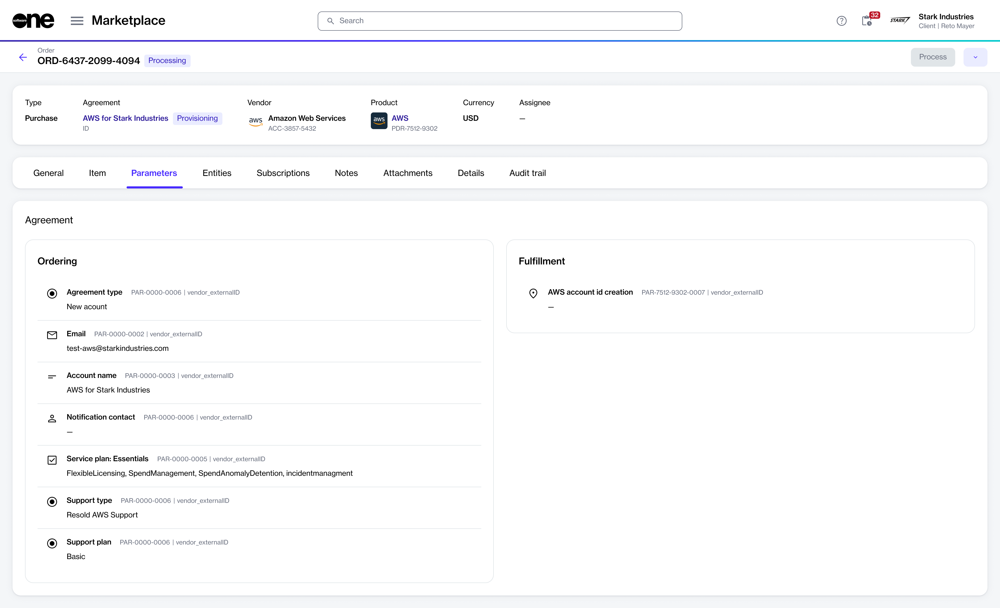

# AWS Concepts

This topic describes some of the key concepts and terminology to help you get started with AWS in the Marketplace Platform.&#x20;

## AWS organization

An organization is a collection of AWS accounts that you can manage centrally and organize into a hierarchical, tree-like structure with a main root at the top and organizational units nested under the root. Each account can be placed directly in the root or within one of the organizational units in the hierarchy.

## AWS organizational units

An organizational unit (OU) is a group of AWS accounts within an organization. An OU can also contain other OUs, enabling you to create a hierarchy.

## Account types

When you sign up for Cloud Managed Services for AWS through the Marketplace Platform, you establish a connection between your AWS-linked accounts and a dedicated payer account owned by SoftwareOne.&#x20;

* **Payer account** - A master payer account plays a crucial role in the AWS organizational structure. It's responsible for consolidating all the charges incurred by the linked AWS accounts and sending invoices to customers. This account acts as the central hub to which various linked accounts connect, forming a cohesive AWS organization.&#x20;
* **Linked account** - These accounts are actively connected to a master payer account. They are responsible for managing specific workloads and utilizing various AWS resources.
* **Standalone account** - A standalone account operates independently of any linked accounts. This type of account is essentially a payer account on its own, provided it has a valid payment method associated with it. AWS requires this to ensure payment processing, so that the account can be billed for the services used. If you are setting up a new AWS account, ensure you have a credit card ready unless you plan to immediately connect it to a master payer account through the **My Organizations** page in the AWS console.

To learn more about AWS concepts and account types, see [Terminology and Concepts for AWS Organizations](https://docs.aws.amazon.com/organizations/latest/userguide/orgs_getting-started_concepts.html).

## AWS Partner-Led vs Resold support 

Two types of support options are available when you order AWS services through the Marketplace Platform: Partner-led and Resold.

* **Partner-led (PLS)** - This is the Enterprise support option led by SoftwareOne, backed by AWS. If you choose this option, SoftwareOne becomes your dedicated point of contact for assistance with your AWS resources. By choosing this support model, you'll receive guidance, how-to advice, and troubleshooting assistance. Additionally, you'll get valuable insights to help you optimize your investment in AWS.&#x20;
* **Resold** - The Resold support is provided by AWS. If you select this option during the ordering process, you'll need to contact AWS for troubleshooting and operational assistance. You'll also need to add your support plan to the AWS console's settings. AWS offers several support plans to suit different business needs, including Basic, Developer, Enterprise, and Business. You can find a list of all plans, their benefits, and pricing on the [AWS Support](https://aws.amazon.com/premiumsupport/?nc=sn\&loc=0) page.&#x20;

The **Parameters** tab within the order details page shows the support model you opted for. This information is available only after you've placed the order.

<figure><figcaption>
Ordering parameters
</figcaption></figure>
