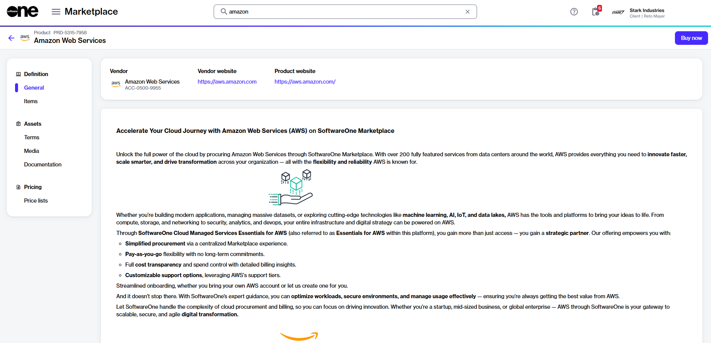
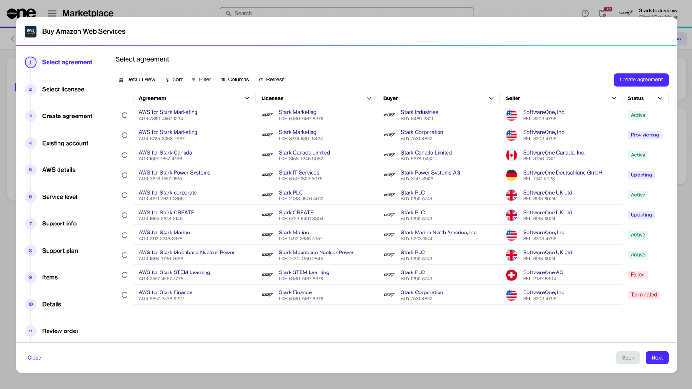

# AWS Through Marketplace

Ordering AWS through Marketplace enables you to leverage the power of AWS cloud computing with the expertise of SoftwareOne. By combining AWS with SoftwareOne's services, you can achieve enhanced scalability, cost-effectiveness, and sustainability, ultimately unlocking the true potential of cloud technology. SoftwareOne also ensures a smooth AWS cloud experience with managed services, automation, and support. 

## AWS in the SoftwareOne Marketplace

As a SoftwareOne client or partner, you can easily order Cloud Managed Services for AWS Essentials through the Marketplace Platform. 

To begin, go to the **Products** page in the platform, located under **Marketplace** in the main navigation menu. Then, look for **Amazon Web Services** to see important information about the services offered. Use the sidebar on the left to learn more about what’s available. You can access various resources like terms and conditions, media files, related documents, and price lists.

Additionally, you can check the details for specific items, including how long the services will be billed for and the commitment terms for each service. 

When you are ready to order, select **Buy now** to start the ordering process.

<figure><figcaption>
Buy now option on the product details page
</figcaption></figure>

## Purchase orders for AWS

The Purchase Wizard for AWS contains a series of steps that must be completed to place the order.&#x20;

<figure><figcaption>
Purchase wizard for AWS
</figcaption></figure>

The steps and options for placing an order vary depending on whether you are creating a new agreement or using an existing one. The process also differs if you are transferring your current account. For instance, if you choose to transfer your account, you can transfer standalone AWS accounts without an organization or your entire AWS organization that includes AWS-linked accounts. To learn more about the different transfer options, see [Account Options](account-options.md).&#x20;

Additionally, you can select a support plan. The SoftwareOne Marketplace offers two options: Partner-led support and Resold support. To understand the differences between these two support models, see [Resold vs partner-led AWS support](aws-concepts.md#resold-vs-partner-led-aws-support).

When you place an AWS order, certain items are included by default. These items may include Reserved Instances, Savings Plans, AWS service incentives, and more. We include these items in your order as placeholders, and you will not be charged for them unless you choose to purchase them from AWS Marketplace. For further information, see [My AWS order contains additional items](faqs/my-aws-order-contains-additional-items.md).

Once you place your order, processing will begin, and the specifics will depend on the options you selected. You can keep track of your order's progress on the [order details ](../../modules-and-features/marketplace/orders/#subscription-details)page.

## Related topics

See the [Tutorials ](tutorials/)section for step-by-step guidance on ordering AWS subscriptions through SoftwareOne Marketplace.
