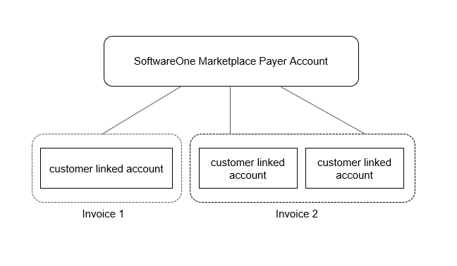
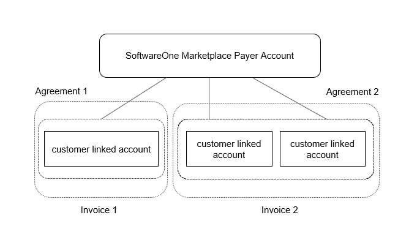
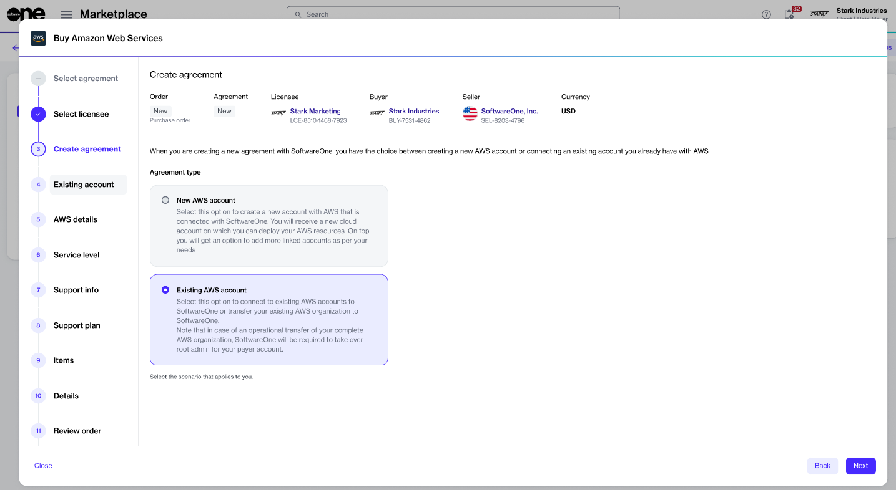

# Can I split my AWS organization cost into separate invoices?

When managing the costs associated with your AWS organization through the SoftwareOne Marketplace, you have the flexibility to split these costs into separate SoftwareOne invoices.

For instance, assume that you have three AWS-linked accounts, and you want one of these accounts to be invoiced separately from the other two. There are two ways to do this: using [Two payer accounts ](can-i-split-my-aws-organization-cost-into-separate-invoices.md#two-separate-payer-accounts)or the [Split invoicing option.](can-i-split-my-aws-organization-cost-into-separate-invoices.md#split-invoicing-option)

### Two payer accounts

In this scenario, you can set up two payer accounts. Payer account 1 can be linked to a single customer-linked account, and payer account 2 will connect to the other two accounts.&#x20;

As a result, both payer accounts will be invoiced separately by SoftwareOne Marketplace and AWS.&#x20;

<figure><figcaption>
Two payer account invoicing
</figcaption></figure>

### Split invoicing option

Another approach is to use the split invoicing option. This option is available for your existing agreements within the Marketplace Platform.&#x20;

This method consolidates your AWS invoices into one for the payer account, but SoftwareOne splits the invoice into two separate invoices.

<figure><figcaption>
One payer account and split cost/agreement invoicing
</figcaption></figure>

If all three AWS accounts must be part of the same AWS organization, then you must use the [split invoicing option](can-i-split-my-aws-organization-cost-into-separate-invoices.md#split-invoicing-option). In such cases, the [two payer account ](can-i-split-my-aws-organization-cost-into-separate-invoices.md#two-separate-payer-accounts)option won't work.

<figure><figcaption>
One payer account and split agreement invoicing
</figcaption></figure>

To set up split invoicing in such a case:

1. **Establish agreement 1** - Create an initial agreement for the first linked account that must be invoiced separately.&#x20;
2. **Create agreement 2** - Create a new agreement under the existing marketplace agreement that was created in step 1. To do this, select the **Existing AWS account** option within the purchase wizard, and then select **Split the cost of your organization** in the next step. This will create agreement 2.

<figure><figcaption>
Existing AWS account option
</figcaption></figure>

3. **Create accounts** - Create all the accounts that you need under agreement 2.

Upon completion of the remaining steps, SoftwareOne will issue separate invoices for agreements 1 and 2. Each invoice will contain detailed information about the respective AWS-linked account included under each agreement.

For more information about options available for existing AWS accounts, see the [Transfer Existing AWS Account](../tutorials/transfer-existing-aws-account.md) tutorial.
