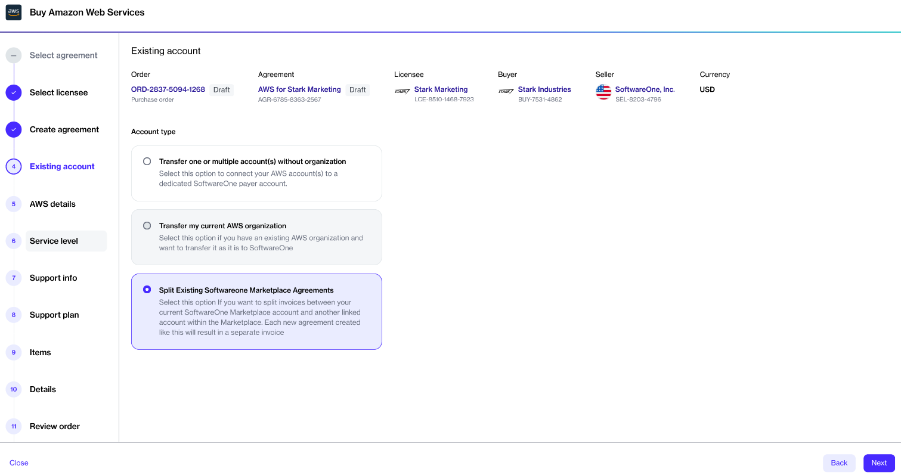

# Can I split my invoices?

If you already have a Marketplace agreement for AWS, you can split your invoices.

To split your invoices, create a new agreement under your existing AWS agreement.&#x20;

To do this, open the purchase wizard for AWS. Complete all steps in the wizard until you get the option to choose the transfer type. Then, select the **Split Existing SoftwareOne Marketplace Agreement** option.

<figure><figcaption>
Split Existing SoftwareOne Marketplace Agreement option
</figcaption></figure>

&#x20;Once you've completed all the remaining steps in the purchase wizard and placed your order, a new agreement will be generated. You'll receive a separate invoice for this new agreement. To learn more, see [How will I be invoiced?](./).
