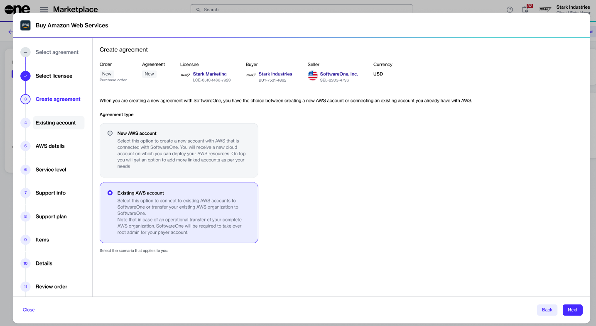

# I already have an AWS account. Can I use that account?

If you have an existing AWS account, you can connect that account with SoftwareOne under the Cloud Managed Service for AWS Essentials. You can connect a single or multiple accounts.&#x20;

This can be done by selecting the **Existing AWS account** option during the ordering process.

<figure><figcaption>
Connect your existing AWS account
</figcaption></figure>

You'll then be able to connect all your accounts individually to a SoftwareOne payer account or transfer your whole AWS organization, including your current AWS payer account. You also have the option to create a new agreement under an existing SoftwareOne payer account. See [Account Options](../account-options.md) to learn more about these options.

<figure><figcaption>
AWS account transfer options
</figcaption></figure>
