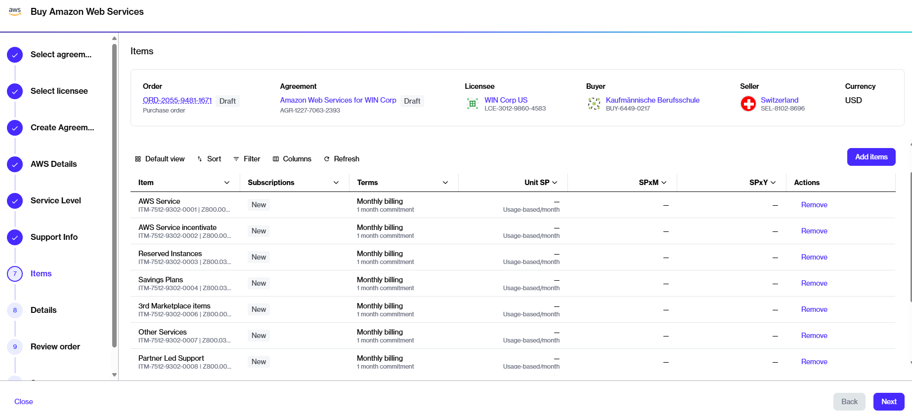

# My AWS order contains additional items

When you place an AWS order through the Marketplace Platform, certain additional items are included in your order by default.&#x20;

<figure><figcaption>
Additional items in your order
</figcaption></figure>

These include items such as Reserved instances,  Savings plans, AWS service incentives, and more.&#x20;

These items are essentially placeholders that have specific permissions linked to your AWS account. You won't incur any charges for these additional items unless you make a purchase through AWS.&#x20;

For instance, if you buy a Savings Plan through the AWS console, this purchase will appear on your next SoftwareOne invoice as the Savings Plans item. If you don't purchase any AWS Savings Plans, there will be no charges.
