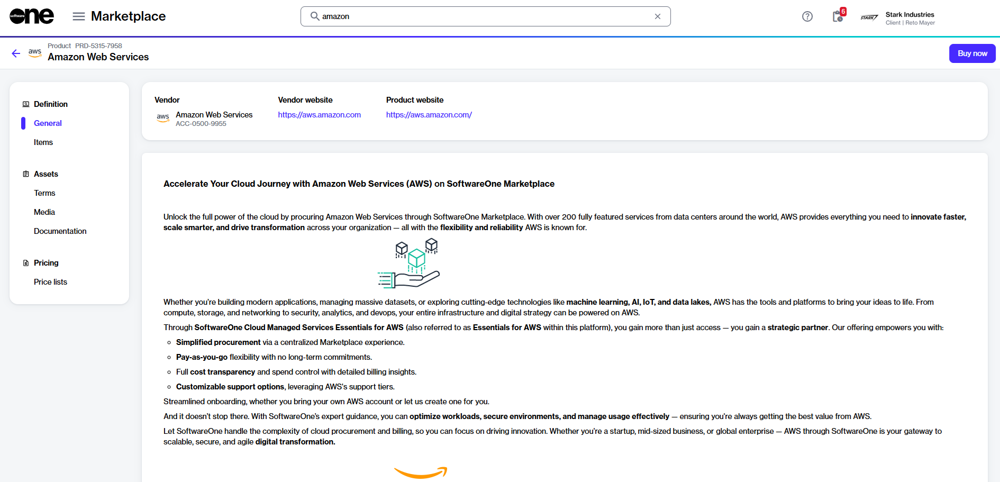
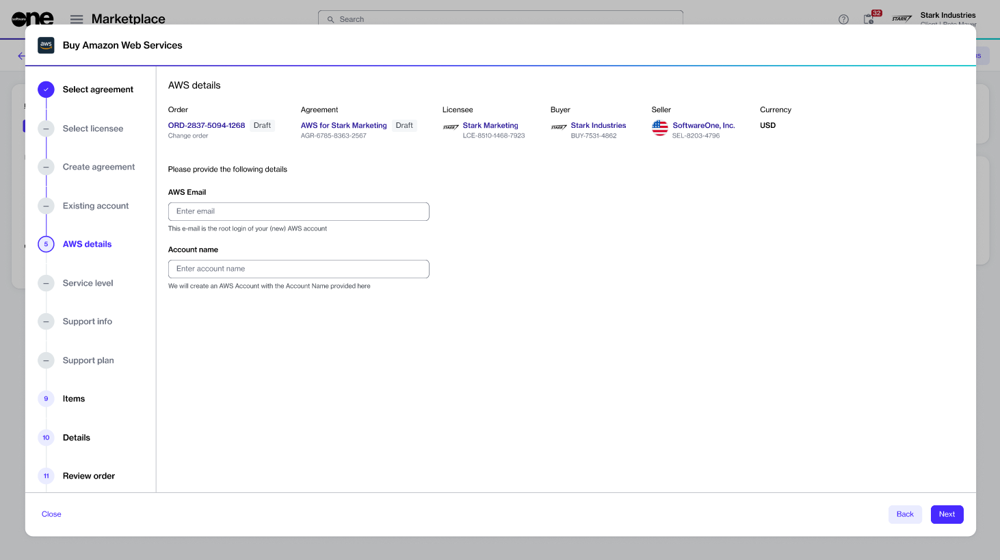

# Add Additional Member Accounts

This tutorial describes how to add AWS-linked accounts to an existing Marketplace agreement by placing a change order.

## Prerequisites 

Before starting this tutorial, make sure that your AWS Marketplace agreement is in the **Active** state. You'll also need to know the email address you want to use to create your member account in AWS and the account name.

## Adding additional member accounts



**Start the purchase wizard for AWS**

To start the wizard:

1. Navigate to the **Products** page.&#x20;
2. From the list of products, select **Amazon Web Services**.&#x20;
3. On the product details page, select **Buy now**. The Purchase Wizard for AWS starts.

<figure><figcaption>
Buy now option on the product details page
</figcaption></figure>




**Follow the wizard to add additional member accounts**

Complete the following steps, making sure to enter or verify the required information where necessary:

1. **Select agreement** - Choose an active agreement and then select **Next**.
2.  **AWS details** - Provide the following details:&#x20;

    1. **Email** - Enter the email address you want to use to create your member account in AWS. Make sure that the email address is unique and hasn't been used previously in the AWS cloud.&#x20;
    2. **Account name** - Enter a name for the new account.

    
<figure><figcaption>
AWS details step
</figcaption></figure>

3. **Items** - Select **Next**. This page shows the existing AWS subscription you ordered under the agreement, along with the new AWS subscription you are about to order. Additionally, you'll see additional items that are included by default and can’t be removed. See [My AWS order contains additional items](../faqs/my-aws-order-contains-additional-items.md) to learn more.
4. **Order details** - Enter the reference information as needed. You can use the **Additional ID** field to enter a PO number to display on your invoice. When done, select **Next**.
5. **Review order** - Review the item and other details. Then, select **Place order** to submit your change order.
6. **Summary** - Select **View order** to navigate to the order details page. Otherwise, select **Close**.



## Next steps 

When your order has been placed, we verify the order details. &#x20;

If there are issues with your order, the [order details](../../../modules-and-features/marketplace/orders/#subscription-details) page will provide information on your next steps.

If there are no issues, we'll create additional AWS member accounts using the name and email address you provided. You'll receive an email with instructions on resetting your password and accessing your account.
